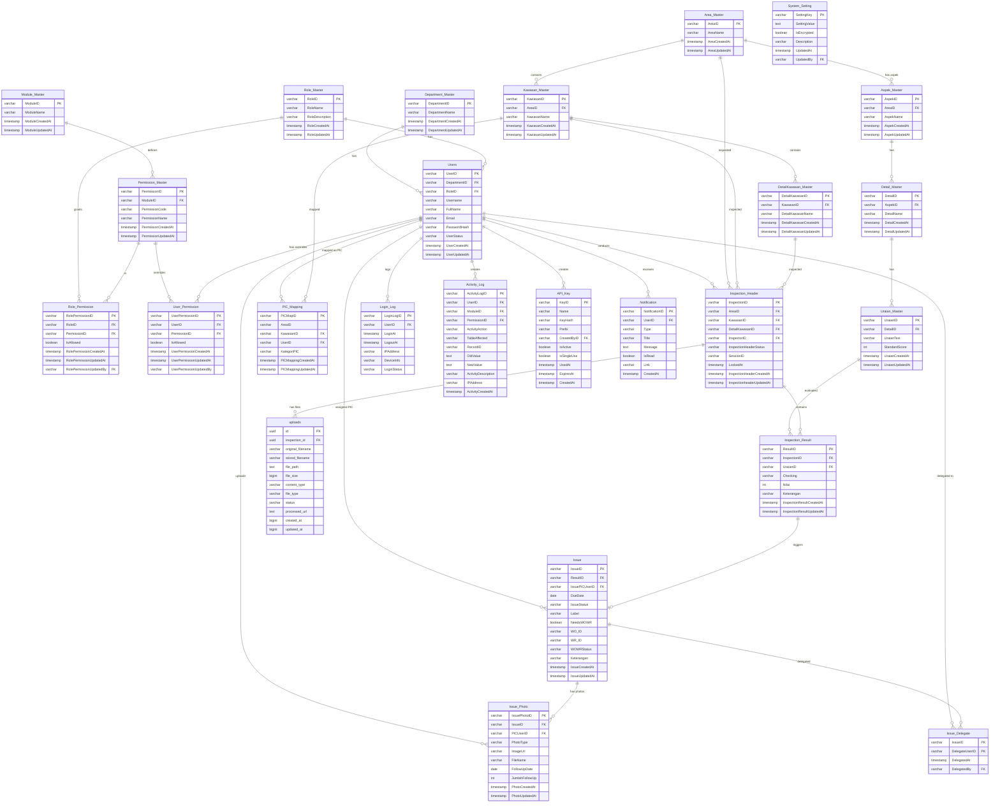

# Entity Relationship Diagram (ERD)
# Sistem Audit Internal Perusahaan — Cimory Audit System

**Versi:** 1.0.0  
**Tanggal:** 2026-07-27  
**Database Engine:** PostgreSQL 15  

---

## 1. Ringkasan Database

Sistem menggunakan **25 tabel** dalam satu database PostgreSQL (`monitoring_audit`), dikelompokkan dalam 7 domain:

| Domain | Tabel |
|:---|:---|
| **Authentication & Access** | `Users`, `Role_Master`, `Department_Master`, `Login_Log` |
| **Authorization (RBAC)** | `Module_Master`, `Permission_Master`, `Role_Permission`, `User_Permission` |
| **Master Data** | `Area_Master`, `Kawasan_Master`, `DetailKawasan_Master`, `Aspek_Master`, `Detail_Master`, `Uraian_Master`, `System_Setting` |
| **PIC** | `PIC_Mapping` |
| **Inspection** | `Inspection_Header`, `Inspection_Result`, `uploads` |
| **Issue & Follow-Up** | `Issue`, `Issue_Photo`, `Issue_Delegate` |
| **System** | `Activity_Log`, `Notification`, `API_Key` |

---

## 2. ERD Diagram (Mermaid)



---

## 3. Deskripsi Tabel Lengkap

### 3.1 Domain: Authentication & Access

#### `Department_Master`
| Kolom | Tipe | Constraint | Keterangan |
|:------|:-----|:-----------|:-----------|
| `DepartmentID` | VARCHAR(20) | PK | ID unik departemen |
| `DepartmentName` | VARCHAR(100) | NOT NULL | Nama departemen |
| `DepartmentCreatedAt` | TIMESTAMP | NOT NULL | Waktu dibuat |
| `DepartmentUpdatedAt` | TIMESTAMP | NOT NULL | Waktu diperbarui |

#### `Role_Master`
| Kolom | Tipe | Constraint | Keterangan |
|:------|:-----|:-----------|:-----------|
| `RoleID` | VARCHAR(20) | PK | ID unik role |
| `RoleName` | VARCHAR(50) | NOT NULL | Nama role (Admin, Auditor, Auditee) |
| `RoleDescription` | VARCHAR(255) | - | Deskripsi role |
| `RoleCreatedAt` | TIMESTAMP | NOT NULL | Waktu dibuat |
| `RoleUpdatedAt` | TIMESTAMP | NOT NULL | Waktu diperbarui |

#### `Users`
| Kolom | Tipe | Constraint | Keterangan |
|:------|:-----|:-----------|:-----------|
| `UserID` | VARCHAR(20) | PK | ID unik user |
| `DepartmentID` | VARCHAR(20) | FK → Department_Master | Departemen user |
| `RoleID` | VARCHAR(20) | FK → Role_Master | Role user |
| `Username` | VARCHAR(50) | UNIQUE, NOT NULL | Username login |
| `FullName` | VARCHAR(100) | NOT NULL | Nama lengkap |
| `Email` | VARCHAR(100) | UNIQUE, NOT NULL | Email |
| `PasswordHash` | VARCHAR(255) | NOT NULL | Bcrypt hash password |
| `UserStatus` | VARCHAR(20) | NOT NULL, DEFAULT 'Active' | Active / Inactive / Suspended |
| `UserCreatedAt` | TIMESTAMP | NOT NULL | Waktu dibuat |
| `UserUpdatedAt` | TIMESTAMP | NOT NULL | Waktu diperbarui |

#### `Login_Log`
| Kolom | Tipe | Constraint | Keterangan |
|:------|:-----|:-----------|:-----------|
| `LoginLogID` | VARCHAR(20) | PK | ID unik log |
| `UserID` | VARCHAR(20) | FK → Users | User yang login |
| `LoginAt` | TIMESTAMP | NOT NULL | Waktu login |
| `LogoutAt` | TIMESTAMP | NULLABLE | Waktu logout |
| `IPAddress` | VARCHAR(50) | - | IP Address |
| `DeviceInfo` | VARCHAR(255) | - | User-Agent / Device |
| `LoginStatus` | VARCHAR(20) | NOT NULL | Success / Failed |

---

### 3.2 Domain: Authorization (RBAC)

#### `Module_Master`
| Kolom | Tipe | Constraint | Keterangan |
|:------|:-----|:-----------|:-----------|
| `ModuleID` | VARCHAR(20) | PK | ID modul (e.g. MOD-INSP, MOD-USR) |
| `ModuleName` | VARCHAR(100) | NOT NULL | Nama modul |

#### `Permission_Master`
| Kolom | Tipe | Constraint | Keterangan |
|:------|:-----|:-----------|:-----------|
| `PermissionID` | VARCHAR(20) | PK | ID permission |
| `ModuleID` | VARCHAR(20) | FK → Module_Master | Modul terkait |
| `PermissionCode` | VARCHAR(50) | NOT NULL | CREATE / READ / UPDATE / DELETE / APPROVE / EXPORT |
| `PermissionName` | VARCHAR(100) | NOT NULL | Nama permission |

#### `Role_Permission`
| Kolom | Tipe | Constraint | Keterangan |
|:------|:-----|:-----------|:-----------|
| `RolePermissionID` | VARCHAR(20) | PK | ID mapping |
| `RoleID` | VARCHAR(20) | FK → Role_Master | Role |
| `PermissionID` | VARCHAR(20) | FK → Permission_Master | Permission |
| `IsAllowed` | BOOLEAN | NOT NULL, DEFAULT TRUE | Apakah izin diberikan |
| `RolePermissionUpdatedBy` | VARCHAR(20) | FK → Users | Siapa yang mengubah |
- **Constraint UNIQUE:** (`RoleID`, `PermissionID`)

#### `User_Permission`
| Kolom | Tipe | Constraint | Keterangan |
|:------|:-----|:-----------|:-----------|
| `UserPermissionID` | VARCHAR(50) | PK | ID override |
| `UserID` | VARCHAR(20) | FK → Users (CASCADE) | User terkait |
| `PermissionID` | VARCHAR(20) | FK → Permission_Master (CASCADE) | Permission |
| `IsAllowed` | BOOLEAN | NOT NULL | Override allow/deny |
- **Constraint UNIQUE:** (`UserID`, `PermissionID`)

---

### 3.3 Domain: Master Data Audit

#### Hierarki Lokasi:
```
Area_Master
└── Kawasan_Master (FK: AreaID)
    └── DetailKawasan_Master (FK: KawasanID)
```

#### Hierarki Checklist:
```
Area_Master
└── Aspek_Master (FK: AreaID)
    └── Detail_Master (FK: AspekID)
        └── Uraian_Master (FK: DetailID) ← StandardScore
```

#### `Uraian_Master` (Checklist Item)
| Kolom | Tipe | Constraint | Keterangan |
|:------|:-----|:-----------|:-----------|
| `UraianID` | VARCHAR(20) | PK | ID uraian |
| `DetailID` | VARCHAR(20) | FK → Detail_Master | Detail terkait |
| `UraianText` | VARCHAR(500) | NOT NULL | Teks item checklist |
| `StandardScore` | INT | NOT NULL, DEFAULT 0 | Skor ideal |

---

### 3.4 Domain: Inspection

#### `Inspection_Header`
| Kolom | Tipe | Constraint | Keterangan |
|:------|:-----|:-----------|:-----------|
| `InspectionID` | VARCHAR(20) | PK | ID inspeksi |
| `AreaID` | VARCHAR(20) | FK → Area_Master | Area inspeksi |
| `KawasanID` | VARCHAR(20) | FK → Kawasan_Master | Kawasan inspeksi |
| `DetailKawasanID` | VARCHAR(20) | FK → DetailKawasan_Master | Detail kawasan |
| `InspectorID` | VARCHAR(20) | FK → Users | Auditor pelaksana |
| `InspectionHeaderStatus` | VARCHAR(30) | NOT NULL | Draft / Ongoing / Completed / Approved |
| `SessionID` | VARCHAR(255) | NULLABLE | Session lock ID |
| `LockedAt` | TIMESTAMP | NULLABLE | Waktu dikunci |

#### `Inspection_Result`
| Kolom | Tipe | Constraint | Keterangan |
|:------|:-----|:-----------|:-----------|
| `ResultID` | VARCHAR(20) | PK | ID hasil penilaian |
| `InspectionID` | VARCHAR(20) | FK → Inspection_Header | Header inspeksi |
| `UraianID` | VARCHAR(20) | FK → Uraian_Master | Item yang dinilai |
| `Checking` | VARCHAR(20) | - | OK / NG / NA |
| `Nilai` | INT | DEFAULT 0 | Skor aktual |
| `Keterangan` | VARCHAR(255) | - | Catatan |

---

### 3.5 Domain: Issue

#### `Issue`
| Kolom | Tipe | Constraint | Keterangan |
|:------|:-----|:-----------|:-----------|
| `IssueID` | VARCHAR(20) | PK | ID issue |
| `ResultID` | VARCHAR(20) | FK → Inspection_Result | Hasil inspeksi pemicu |
| `IssuePICUserID` | VARCHAR(20) | FK → Users | PIC bertanggung jawab |
| `DueDate` | DATE | - | Batas waktu penyelesaian |
| `IssueStatus` | VARCHAR(30) | DEFAULT 'Open' | Open / InProgress / PendingValidation / Closed / Verified |
| `Label` | VARCHAR(100) | DEFAULT '' | Label kategori issue |
| `NeedsWOWR` | BOOLEAN | DEFAULT FALSE | Apakah perlu Work Order/Request |
| `WO_ID` | VARCHAR(100) | DEFAULT '' | ID Work Order |
| `WR_ID` | VARCHAR(100) | DEFAULT '' | ID Work Request |
| `WOWRStatus` | VARCHAR(50) | DEFAULT 'None' | None / PendingValidation / Verified / Rejected |

#### `Issue_Photo`
| Kolom | Tipe | Constraint | Keterangan |
|:------|:-----|:-----------|:-----------|
| `IssuePhotoID` | VARCHAR(20) | PK | ID foto |
| `IssueID` | VARCHAR(20) | FK → Issue | Issue terkait |
| `PICUserID` | VARCHAR(20) | FK → Users | Uploader |
| `PhotoType` | VARCHAR(20) | NOT NULL | Initial / FollowUp / WOWR |
| `ImageUrl` | VARCHAR(255) | - | URL foto di MinIO |
| `FollowUpDate` | DATE | - | Tanggal follow-up |
| `JumlahFollowUp` | INT | - | Urutan follow-up ke-n |

---

### 3.6 Domain: System

#### `API_Key`
| Kolom | Tipe | Constraint | Keterangan |
|:------|:-----|:-----------|:-----------|
| `KeyID` | VARCHAR(50) | PK | ID key |
| `Name` | VARCHAR(100) | NOT NULL | Label key |
| `KeyHash` | VARCHAR(255) | UNIQUE, NOT NULL | SHA-256 hash dari raw token |
| `Prefix` | VARCHAR(20) | NOT NULL | 12 karakter pertama raw token (untuk identifikasi) |
| `CreatedByID` | VARCHAR(50) | FK → Users | Admin pembuat |
| `IsActive` | BOOLEAN | DEFAULT TRUE | Status aktif |
| `IsSingleUse` | BOOLEAN | DEFAULT TRUE | Mode penggunaan |
| `UsedAt` | TIMESTAMP | NULLABLE | Waktu dipakai (untuk single-use) |
| `ExpiresAt` | TIMESTAMP | NULLABLE | Waktu kedaluwarsa |

#### `Notification`
| Kolom | Tipe | Constraint | Keterangan |
|:------|:-----|:-----------|:-----------|
| `NotificationID` | VARCHAR(50) | PK | ID notifikasi |
| `UserID` | VARCHAR(50) | FK → Users (CASCADE) | Penerima |
| `Type` | VARCHAR(20) | NOT NULL | info / warning / error / success |
| `Title` | VARCHAR(255) | NOT NULL | Judul notifikasi |
| `Message` | TEXT | NOT NULL | Isi notifikasi |
| `IsRead` | BOOLEAN | DEFAULT FALSE | Status baca |
| `Link` | VARCHAR(255) | - | URL target |

---

## 4. Index Database

| Tabel | Index | Kolom |
|:------|:------|:------|
| `Users` | `uq_users_username` (UNIQUE) | `Username` |
| `Users` | `uq_users_email` (UNIQUE) | `Email` |
| `Role_Permission` | `uq_role_permission` (UNIQUE) | `RoleID`, `PermissionID` |
| `User_Permission` | `uq_user_permission` (UNIQUE) | `UserID`, `PermissionID` |
| `API_Key` | `uq_apikey_hash` (UNIQUE) | `KeyHash` |
| `Notification` | `idx_notification_user_id` | `UserID` |
| `Notification` | `idx_notification_created_at` | `CreatedAt` |

---

## 5. Skema Migrasi

| File | Konten |
|:-----|:-------|
| `001_initial.sql` | Tabel dasar: Users, Role_Master, Department_Master, Area_Master, dsb. |
| `002_xxx.sql` | Tabel Kawasan, Detail Kawasan, Aspek, Detail, Uraian |
| `003_xxx.sql` | Tabel Inspection_Header, Inspection_Result |
| `004_xxx.sql` | Tabel Issue, Issue_Photo |
| `005_xxx.sql` | Tabel Login_Log, Activity_Log |
| `006_xxx.sql` | Tabel System_Setting, PIC_Mapping |
| `007_xxx.sql` | Tabel Module_Master, Permission_Master, Role_Permission |
| `008_alter_tables_for_new_features.sql` | Menambah kolom SessionID, LockedAt di Inspection_Header; Label, NeedsWOWR, WO_ID, WR_ID di Issue; tabel uploads |
| `009_add_wowr_status_to_issue.sql` | Menambah kolom WOWRStatus di Issue |
| `010_create_notification_tables.sql` | Membuat tabel Notification |
| `011_alter_pic_mapping_area_nullable.sql` | AreaID di PIC_Mapping menjadi nullable |
| `012_create_user_permission.sql` | Membuat tabel User_Permission |
