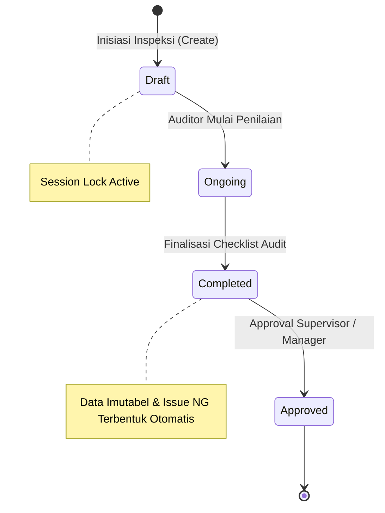
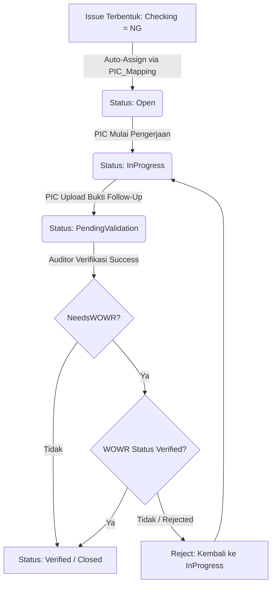
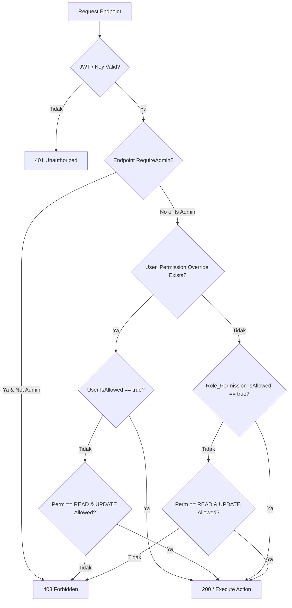

# Business Rules Documentation
# Sistem Audit Internal Perusahaan — Cimory Audit System

**Versi:** 1.0.0  
**Tanggal:** 2026-07-27  
**Status:** Production-Ready  
**Otoritas:** Tim Engineering & Quality Assurance Cimory  

---

## Executive Summary

Dokumen ini mendefinisikan seluruh aturan bisnis (*business rules*) yang berlaku pada Sistem Audit Internal Perusahaan (Cimory Audit System). Aturan-aturan ini mengatur logika aplikasi (*application logic*), batasan operasional (*operational constraints*), dan workflow transaksi antar modul untuk memastikan integritas data audit GMP (Good Manufacturing Practice), keamanan sistem, serta kepatuhan terhadap standar operasional perusahaan.

---

## 1. Aturan Inspeksi (Inspection Rules)

Modul Inspeksi mengatur siklus hidup pelaksanaan audit GMP di area/kawasan produksi manufaktur.

### 1.1 Lock Kombinasi Sesi (Session Lock)
- **BR-INSP-001:** Satu sesi inspeksi aktif hanya bisa dibuat untuk kombinasi unik: `AreaID` + `KawasanID` + `DetailKawasanID` pada rentang waktu yang sama (SessionID lock).
- **BR-INSP-002:** Jika masih ada inspeksi dengan status `Draft` atau `Ongoing` untuk kombinasi area/kawasan yang sama, sistem akan menolak pembuatan sesi baru (HTTP 400 / 409 Conflict).

### 1.2 Lifecycle & Alur Status unidirectional
- **BR-INSP-003:** Status inspeksi mengikuti alur linier searah (*unidirectional flow*):
  $$\text{Draft} \longrightarrow \text{Ongoing} \longrightarrow \text{Completed} \longrightarrow \text{Approved}$$
- **BR-INSP-004:** Status inspeksi **tidak dapat dimundurkan** ke tahap sebelumnya (misalnya dari `Ongoing` kembali ke `Draft`, atau `Completed` kembali ke `Ongoing`).

### 1.3 Imutabilitas Data Inspeksi
- **BR-INSP-005:** Inspeksi yang telah mencapai status `Completed` atau `Approved` menjadi **imutabel** (*read-only*).
- **BR-INSP-006:** Nilai checking (`OK`, `NG`, `NA`), skor, maupun keterangan pada `Inspection_Result` dari inspeksi `Completed` tidak dapat diubah, ditambah, atau dihapus oleh siapapun.

### 1.4 Otorisasi Eksekusi Inspeksi
- **BR-INSP-007:** Hanya user dengan role **Auditor** (atau Admin) yang berhak membuat (*create*), mengisi (*update result*), dan menyelesaikan (*complete*) inspeksi.
- **BR-INSP-008:** Auditee (PIC Area) hanya memiliki akses *read-only* terhadap hasil inspeksi.

### 1.5 Otomatisasi Pembuatan Issue
- **BR-INSP-009:** Pada saat status inspeksi berubah dari `Ongoing` menjadi `Completed`, sistem secara otomatis memindai seluruh item penilaian (`Inspection_Result`).
- **BR-INSP-010:** Untuk setiap item dengan `Checking = NG`, sistem secara otomatis meng-generate entitas `Issue` baru.

---

## 2. Aturan Issue (Issue Management Rules)

Modul Issue mengelola siklus hidup temuan ketidaksesuaian (*Non-Conformance*) hasil audit GMP.

### 2.1 Assignment Otomatis PIC
- **BR-ISS-001:** Setiap Issue yang tercipta otomatis saat inspeksi `Completed` akan di-assign ke user PIC berdasarkan konfigurasi `PIC_Mapping` untuk `KawasanID` terkait.
- **BR-ISS-002:** Jika kawasan memiliki multiple PIC, sistem menunjuk PIC utama (atau membuat assignment ke PIC terdaftar pertama) dan mengizinkan re-assignment oleh Auditor.

### 2.2 Lifecycle Status Issue
- **BR-ISS-003:** Status lifecycle Issue terdiri dari:
  $$\text{Open} \longrightarrow \text{InProgress} \longrightarrow \text{PendingValidation} \longrightarrow \begin{cases} \text{Closed} \\ \text{Verified} \end{cases}$$
- **BR-ISS-004:** Penjelasan status:
  - `Open`: Temuan baru tercipta, menunggu respon PIC.
  - `InProgress`: PIC sedang melakukan perbaikan fisik / operasional.
  - `PendingValidation`: PIC telah mengunggah bukti perbaikan dan mengajukan verifikasi.
  - `Verified`: Auditor memverifikasi bahwa perbaikan telah valid & sesuai standar.
  - `Closed`: Issue dinyatakan selesai dan ditutup.

### 2.3 Imutabilitas Keberadaan Data
- **BR-ISS-005:** Issue yang sudah dibuat **tidak dapat dihapus** dari database (*hard delete* maupun *soft delete* dilarang).
- **BR-ISS-006:** Riwayat issue wajib tersimpan secara permanen untuk keperluan pelaporan GMP dan histori kepatuhan audit. Perubahan hanya diperbolehkan pada status dan atribusi follow-up.

### 2.4 Hak Akses Update PIC
- **BR-ISS-007:** PIC (Auditee) hanya dapat mengubah status atau mengunggah bukti follow-up pada Issue yang **di-assign secara langsung ke dirinya** atau yang **didelegasikan resmi** kepadanya via `Issue_Delegate`.
- **BR-ISS-008:** Attempt untuk memperbarui Issue milik PIC lain akan ditolak oleh sistem (HTTP 403 Forbidden).

### 2.5 Persyaratan Verifikasi Auditor
- **BR-ISS-009:** Untuk mengubah status Issue menjadi `Closed` atau `Verified`, Auditor **wajib memverifikasi** foto bukti perbaikan (`FollowUp` photo) yang telah diunggah oleh PIC.
- **BR-ISS-010:** Auditor berhak menolak bukti perbaikan, yang akan mengembalikan status Issue dari `PendingValidation` ke `InProgress`.

### 2.6 Prasyarat Validation WOWR
- **BR-ISS-011:** Issue dengan atribut `NeedsWOWR = true` **tidak dapat diverifikasi atau ditutup** sebelum parameter `WO_ID` (Work Order ID) dan `WR_ID` (Work Request ID) terisi valid.
- **BR-ISS-012:** Status WOWR (`WOWRStatus`) harus bernilai `Verified` oleh Auditor sebelum Issue utama dapat ditutup (`Closed`).

---

## 3. Aturan WOWR (Work Order / Work Request Rules)

Aturan khusus untuk temuan yang membutuhkan perbaikan fasilitas/mesin skala menengah-besar melalui sistem fasilitas teknik.

### 3.1 Lifecycle WOWRStatus
- **BR-WOWR-001:** Alur status `WOWRStatus` pada Issue:
  $$\text{None} \longrightarrow \text{PendingValidation} \longrightarrow \begin{cases} \text{Verified} \\ \text{Rejected} \end{cases}$$
- **BR-WOWR-002:** `None`: Kondisi awal saat issue ditandai butuh Work Order.
- **BR-WOWR-003:** `PendingValidation`: Terjadi saat PIC berhasil melakukan submission `WO_ID` dan `WR_ID` beserta foto dokumen WOWR.
- **BR-WOWR-004:** `Verified`: Auditor mengonfirmasi bahwa nomor WO/WR terdaftar dan sesuai.
- **BR-WOWR-005:** `Rejected`: Auditor menolak nomor/dokumen WO/WR karena tidak sesuai.

### 3.2 Penanganan Penolakan (Rejection Workflow)
- **BR-WOWR-006:** Jika `WOWRStatus` diubah menjadi `Rejected` oleh Auditor, PIC **wajib melakukan resubmission** nomor WO_ID & WR_ID yang valid beserta bukti foto pendukung baru.
- **BR-WOWR-007:** Saat resubmission dilakukan, `WOWRStatus` kembali berubah ke `PendingValidation` untuk ditinjau ulang oleh Auditor.

| Status Awal | Aksi User | Peran User | Status Akhir | Catatan Syarat |
|:---|:---|:---|:---|:---|
| `None` | Submit WO/WR ID & Photo | PIC (Auditee) | `PendingValidation` | WO_ID & WR_ID tidak boleh kosong |
| `PendingValidation` | Approve WOWR | Auditor | `Verified` | Membuka blokir penutupan Issue |
| `PendingValidation` | Reject WOWR | Auditor | `Rejected` | Catatan alasan reject wajib diisi |
| `Rejected` | Resubmit WO/WR ID | PIC (Auditee) | `PendingValidation` | Mengunggah perbaikan data WO/WR |

---

## 4. Aturan Foto & Upload (Photo & Media Rules)

Mengatur validasi dan klasifikasi file gambar yang diunggah ke dalam sistem audit.

### 4.1 Klasifikasi PhotoType
- **BR-IMG-001:** Setiap foto yang diunggah ke `Issue_Photo` wajib memiliki atribut `PhotoType` yang valid:
  - `Initial`: Foto temuan kondisi ketidaksesuaian asli di lapangan (diunggah oleh Auditor saat inspeksi).
  - `FollowUp`: Foto bukti fisik tindakan perbaikan yang telah dilakukan (diunggah oleh PIC).
  - `WOWR`: Foto/scan cetak form Work Order atau Work Request dari departemen Maintenance (diunggah oleh PIC).

### 4.2 Restriksi Format File
- **BR-IMG-002:** File media yang diizinkan hanya format gambar dengan MIME-type:
  - `image/jpeg` (`.jpg`)
  - `image/pjpeg` (`.jpeg`)
  - `image/png` (`.png`)
- **BR-IMG-003:** Ekstensi file executable, PDF, dokumen teks, atau kompresi (`.exe`, `.pdf`, `.zip`, `.docx`, dll.) akan langsung ditolak oleh API Gateway / Upload Middleware.

### 4.3 Ukuran Maksimum File
- **BR-IMG-004:** Ukuran maksimum per file yang diunggah adalah **10 MB (10.485.760 bytes)**.
- **BR-IMG-005:** File yang melebihi batas 10 MB akan memicu response HTTP 413 Payload Too Large.

---

## 5. Aturan PIC Mapping (Person in Charge Mapping Rules)

Mengatur hubungan pemetaan penanggung jawab (PIC) terhadap kawasan audit.

### 5.1 Kardinalitas User ke Kawasan
- **BR-PIC-001:** Satu User (Auditee) dapat terdaftar sebagai PIC untuk **banyak Kawasan** ($1 : N$).

### 5.2 Kardinalitas Kawasan ke User
- **BR-PIC-002:** Satu Kawasan dapat memiliki **banyak PIC** ($1 : N$). Hal ini memungkinkan pembagian penanggung jawab per shift kerja atau kategori teknis di kawasan tersebut.

### 5.3 Aturan AreaID Nullable
- **BR-PIC-003:** Field `AreaID` pada tabel `PIC_Mapping` bersifat **nullable** (dapat bernilai `NULL`).
- **BR-PIC-004:** Jika `AreaID` diisi `NULL`, maka pemetaan PIC berlaku secara spesifik berdasarkan `KawasanID` tanpa membatasi hierarki Area induk.

---

## 6. Aturan API Key (Power BI & External Integration Rules)

Mengatur penerbitan, otentikasi, dan tata kelola API Key untuk integrasi analitik eksternal (Power BI / Data Warehouse).

### 6.1 Hashing & Keamanan Token
- **BR-KEY-001:** Raw token API Key (`MAKEY_<48_hex_chars>`) **hanya ditampilkan satu kali** pada saat pembuatan.
- **BR-KEY-002:** Raw token **dilarang keras disimpan dalam bentuk plaintext** di database. Sistem hanya menyimpan nilai Hash **SHA-256** dari token tersebut.
- **BR-KEY-003:** Verifikasi request API Key dilakukan dengan menghitung SHA-256 dari token request, kemudian membandingkan hash-nya dengan record di database.

### 6.2 Key Single-Use (Sekali Pakai)
- **BR-KEY-004:** Jika API Key dibuat dengan flag `IsSingleUse = true`, maka setelah key tersebut sukses digunakan pada 1 request HTTP (HTTP 200 OK), sistem akan **otomatis menonaktifkan key** (`IsActive = false`) dan mengoreksi `UsedAt = CurrentTimestamp()`.
- **BR-KEY-005:** Request selanjutnya menggunakan key single-use yang sama akan ditolak dengan error 401 Unauthorized ("API key has already been used").

### 6.3 Restriksi Visibilitas Admin
- **BR-KEY-006:** Admin hanya berhak melihat, mengelola, dan memfilter daftar API Key yang **dibuat oleh dirinya sendiri** (`CreatedByID = CurrentUserID`).
- **BR-KEY-007:** Admin tidak dapat melihat atau mengedit API Key yang diterbitkan oleh Admin lain.

### 6.4 Permanent Invalidation
- **BR-KEY-008:** API Key yang statusnya telah **Expired** (melewati `ExpiresAt`) atau telah **Revoked** (`IsRevoked = true`) **tidak dapat diaktifkan kembali** under any circumstances.
- **BR-KEY-009:** Untuk pemakaian berlanjut, Admin harus menerbitkan API Key baru.

---

## 7. Aturan Notifikasi (Notification Rules)

Mengatur mekanika pengiriman notifikasi internal dan real-time push notification via Server-Sent Events (SSE).

### 7.1 Trigger Assignment Issue Baru
- **BR-NOTIF-001:** Saat entitas `Issue` baru terbentuk (baik otomatis dari inspeksi maupun pembuatan manual), sistem secara otomatis meng-generate data notifikasi in-app untuk PIC ter-assign.
- **BR-NOTIF-002:** Notifikasi berisi judul issue, lokasi kawasan, dan tautan langsung ke detail temuan.

### 7.2 Trigger Upload Follow-Up Bukti
- **BR-NOTIF-003:** Saat PIC mengunggah foto `FollowUp` dan mengubah status issue ke `PendingValidation`, sistem secara otomatis meng-generate notifikasi ke Auditor pembuat inspeksi terkait.

### 7.3 Delivery Real-Time via SSE
- **BR-NOTIF-004:** Jika user penerima sedang dalam sesi aktif (online) di frontend web, sistem akan menyalurkan pesan notifikasi secara **real-time melalui koneksi SSE (Server-Sent Events)** (`/api/v1/notifications/sse`).
- **BR-NOTIF-005:** Jika user offline, notifikasi disimpan di database `Notification` dan disajikan saat user melakukan login/poll berikutnya.

---

## 8. Aturan Permissions & RBAC (Authorization Rules)

Mengatur hirarki otorisasi akses API berbasis Role dan User Specific Override.

### 8.1 Evaluasi Hierarki Override
- **BR-RBAC-001:** Pengecekan otorisasi menggunakan hirarki dua tingkat:
  $$\text{User\_Permission (User Override)} \succ \text{Role\_Permission (Role Baseline)}$$
- **BR-RBAC-002:** Jika terdapat record aktif pada `User_Permission` untuk `UserID` + `PermissionID` tertentu, maka status `IsAllowed` pada `User_Permission` **selalu mengalahkan** nilai pada `Role_Permission`.

### 8.2 Implisit Read Permission
- **BR-RBAC-003:** Jika seorang user memiliki izin `UPDATE` pada suatu modul, secara **implisit user tersebut juga memiliki izin `READ`** untuk modul tersebut, meskipun persetujuan `READ` secara eksplisit diset `false` atau tidak terdaftar.

### 8.3 Restriksi Endpoint Admin
- **BR-RBAC-004:** Seluruh endpoint pengelola API Key (`/api/v1/api-keys/*`) diproteksi dengan middleware `RequireAdmin`.
- **BR-RBAC-005:** User tanpa `RoleID = ROLE-001` (Admin) akan langsung ditolak (HTTP 403 Forbidden) sebelum mengeksekusi use case API Key.

---

## 9. Aturan Password & Autentikasi (Password Security Rules)

Mengatur standar keamanan kredensial akun pengikut standar OWASP.

### 9.1 Panjang Minimum Kredensial
- **BR-SEC-001:** Setiap password baru (pada registrasi user, ubah password, reset password) **wajib memiliki panjang minimal 8 karakter**.

### 9.2 Verifikasi Password Lama (Self-Service Change)
- **BR-SEC-002:** Pada fitur ganti password mandiri (`ChangePasswordRequest`), user **wajib menyertakan dan memverifikasi `old_password`** yang cocok dengan hash di database sebelum `new_password` diproses.
- **BR-SEC-003:** Admin reset password (`AdminResetPasswordRequest`) dikecualikan dari verifikasi password lama.

### 9.3 Hashing Standar Wajib
- **BR-SEC-004:** Seluruh password disimpan menggunakan algoritma **Bcrypt** dengan cost factor standar (min. 10).
- **BR-SEC-005:** Penyimpanan password dalam bentuk *plaintext* atau enkripsi dua arah (*reversible encryption*) dilarang keras.

---

## 10. Aturan Settings & Enkripsi (System Settings Rules)

Mengatur tata kelola variabel konfigurasi tingkat sistem.

### 10.1 Enkripsi Field Sensitif
- **BR-SET-001:** Parameter konfigurasi sensitif (seperti `SMTP_PASSWORD`, `ENCRYPTION_KEY`, `JWT_SECRET`) wajib disimpan dalam keadaan terenkripsi menggunakan algoritma **AES-256-GCM** pada database (`System_Setting`).
- **BR-SET-002:** Aplikasi melakukan dekripsi saat runtime menggunakan master key server.

### 10.2 Hak Akses Konfigurasi
- **BR-SET-003:** Membaca (kecuali non-sensitif) dan Mengubah konfigurasi `System_Setting` **hanya dapat dilakukan oleh user dengan Role Admin**.
- **BR-SET-004:** Perubahan setting sistem akan mencatat jejak audit penuh ke `Activity_Log`.

---

## Ringkasan Matriks Aturan Bisnis Utama

| Kode Aturan | Modul | Deskripsi Singkat | Enforced At |
|:---|:---|:---|:---|
| `BR-INSP-001` | Inspection | Lock 1 sesi aktif per Area+Kawasan+DetailKawasan | UseCase / DB Constraint |
| `BR-INSP-003` | Inspection | Status linier: Draft → Ongoing → Completed → Approved | UseCase Validation |
| `BR-INSP-010` | Inspection | Auto-create Issue saat status Completed untuk result NG | Transaction Handler |
| `BR-ISS-001` | Issue | Auto-assign PIC sesuai PIC_Mapping kawasan | UseCase Handler |
| `BR-ISS-005` | Issue | Issue imutabel (dilarang hapus data / hard delete) | Repository / Route Restriction |
| `BR-ISS-011` | Issue | NeedsWOWR=true butuh WO_ID & WR_ID sebelum closed | Validation Handler |
| `BR-IMG-004` | Upload | Ukuran file max 10 MB & MIME Type gambar | Upload Middleware |
| `BR-KEY-002` | API Key | Raw token disimpan sebagai Hash SHA-256 saja | UseCase Auth |
| `BR-KEY-004` | API Key | Single-use key otomatis ter-deaktivasi setelah 1x pakai | Bearer Middleware |
| `BR-RBAC-001` | Auth/RBAC | User_Permission override mengalahkan Role_Permission | Permission Middleware |
| `BR-SEC-004` | Auth | Hashing password wajib Bcrypt (min. 8 char) | Auth UseCase |
| `BR-SET-001` | Settings | Enkripsi AES-256 untuk setting sensitif | System Setting Handler |
