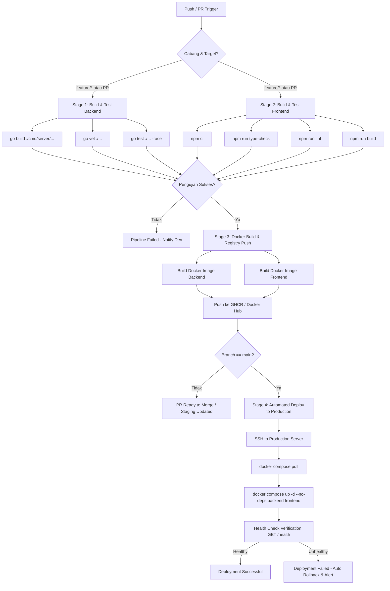

# CI/CD Pipeline & Development Pipeline Documentation
# Sistem Audit Internal Perusahaan — Cimory Audit System

**Versi:** 1.0.0  
**Tanggal:** 2026-07-27  

---

## 1. Development Workflow

Proses pengembangan perangkat lunak pada **Cimory Audit System** menerapkan standar industri yang ketat untuk menjamin stabilitas kode, keamanan, dan kolaborasi tim pengembang yang terstruktur.

```
       ┌─────────────────────────────────────────────────────────────┐
       │                       feature/*                             │
       │  (Fitur baru, bugfix, refactoring per modul/tugas)          │
       └──────────────────────────────┬──────────────────────────────┘
                                      │
                                      ▼  Pull Request (1 Reviewer Approval + CI Checks)
       ┌─────────────────────────────────────────────────────────────┐
       │                       develop                               │
       │  (Staging Environment — Integrasi & Pengujian QA)            │
       └──────────────────────────────┬──────────────────────────────┘
                                      │
                                      ▼  Release Pull Request / Tagged Release
       ┌─────────────────────────────────────────────────────────────┐
       │                       main                                  │
       │  (Production Environment — Stable Release)                   │
       └─────────────────────────────────────────────────────────────┘
```

### 1.1 Git Branching Strategy

Sistem ini menggunakan cabang Git yang terstruktur berbasis **Git Flow simplified**:

| Branch | Lingkungan | Akses Direct Commit | Deskripsi & Aturan |
|:-------|:-----------|:-------------------|:-------------------|
| `main` | Production | ❌ Dilarang | Menyimpan source code versi rilis produksi yang stabil. Hanya menerima *merge* dari `develop` atau `hotfix/*` melalui PR. |
| `develop` | Staging | ❌ Dilarang | Cabang utama integrasi pengujian staging. Semua fitur baru digabungkan di sini terlebih dahulu sebelum rilis produksi. |
| `feature/*` | Development |  Diizinkan | Cabang untuk pengerjaan fitur baru atau perbaikan non-kritis. Penamaan: `feature/nama-fitur` atau `fix/deskripsi-issue`. |
| `hotfix/*` | Hotfix Prod |  Diizinkan | Cabang darurat untuk memperbaiki bug kritis di Production secara langsung dari `main`, kemudian di-merge balik ke `main` dan `develop`. |

### 1.2 Commit Message Convention

Format pesan commit mengikuti standar **Conventional Commits** untuk memudahkan pembuatan changelog otomatis dan pelacakan riwayat perubahan:

$$\text{Format: } \langle\text{type}\rangle(\langle\text{scope}\rangle): \langle\text{description}\rangle$$

* **Tipe Commit (`type`):**
  * `feat`: Penambahan fitur baru (misal: `feat(inspection): add offline checklist draft`)
  * `fix`: Perbaikan bug (misal: `fix(auth): resolve JWT expiration parsing issue`)
  * `docs`: Perubahan atau penambahan dokumentasi (misal: `docs(pipeline): update CI deployment steps`)
  * `refactor`: Perubahan kode yang tidak mengubah perilaku atau fitur (misal: `refactor(usecase): simplify issue scoring logic`)
  * `chore`: Tugas pemeliharaan build, dependency, atau konfigurasi (misal: `chore(deps): upgrade Go Fiber to v2.52`)
  * `test`: Penambahan atau perbaikan unit/integration test (misal: `test(handler): add unit tests for powerbi handler`)

> **Aturan:** Pesan commit harus dalam huruf kecil (lowercase), menggunakan kata kerja imperatif (*add*, *fix*, *update*), dan tidak diakhiri tanda titik.

### 1.3 Code Review Process

1. **Pull Request (PR) Requirement:**  
   Setiap merge ke cabang `develop` maupun `main` **wajib** melalui Pull Request. Push langsung ke branch terlindungi (`main` & `develop`) dikunci via branch protection rules di GitHub.
2. **Reviewer Approval:**  
   Setiap PR membutuhkan minimal **1 persetujuan (approval)** dari Senior Developer / Tech Lead sebelum tombol merge dapat diaktifkan.
3. **Automated Status Checks:**  
   PR baru dapat di-merge jika seluruh pengujian otomatis pada CI Pipeline (unit test, linter, type check, build test) berstatus **PASSED** (hijau).

### 1.4 Merge Strategy

* **Feature Branches (`feature/*` $\rightarrow$ `develop`):** Menggunakan **Squash and Merge**. Seluruh commit eksplorasi/draft dalam feature branch dikompres menjadi 1 commit bersih pada `develop` untuk menjaga riwayat git tetap rapi dan *linear*.
* **Staging to Production (`develop` $\rightarrow$ `main`):** Menggunakan **Rebase and Merge** atau **Standard Merge Commit** dengan tagged version (misal `v1.0.0`) untuk menandai titik rilis produksi secara presisi.

---

## 2. CI/CD Pipeline Architecture

CI/CD Pipeline mengotomatisasi pengujian, pembuatan artifact container, dan pengelaran aplikasi menggunakan **GitHub Actions**.

### 2.1 Pipeline Flowchart Diagram



### 2.2 Pipeline Stages Detail

#### Stage 1: Build & Test Backend (Go)
1. **Dependency Download:** Menyiapkan runtime Go 1.25+ dan mengunduh `go.mod` dependencies.
2. **Compilation Verification:** Menjalankan `go build ./cmd/server/...` untuk memastikan tidak ada kesalahan kompilasi.
3. **Static Code Analysis:** Menjalankan `go vet ./...` untuk mendeteksi kejanggalan struktural atau potensi bug pada sintaks Go.
4. **Automated Testing:** Menjalankan `go test ./... -race` untuk mengeksekusi unit test sekaligus mendeteksi *data race condition* dalam goroutines.

#### Stage 2: Build & Test Frontend (Next.js 15)
1. **Clean Installation:** Menjalankan `npm ci` untuk menginstal dependensi persis sesuai `package-lock.json`.
2. **Static Type Check:** Menjalankan `npm run type-check` (TypeScript `tsc --noEmit`) untuk validasi tipe data seluruh komponen.
3. **Linter Audit:** Menjalankan `npm run lint` (ESLint) untuk memastikan kepatuhan terhadap standar penulisan kode.
4. **Production Build Test:** Menjalankan `npm run build` untuk menguji pembuatan halaman Next.js (App Router static/SSR compilation).

#### Stage 3: Docker Image Packaging
1. **Multi-stage Docker Build:** Mengompres ukuran image akhir dengan memisahkan tahap *builder* dan tahap *runtime*.
2. **Container Registry Push:** Menandai (*tagging*) image dengan commit SHA (`:sha-xxxxxx`) dan versi rilis (`:latest`, `:v1.0.0`), kemudian melakukan *push* ke GitHub Container Registry (`ghcr.io`).

#### Stage 4: Continuous Deployment (Main Branch Only)
1. **SSH Authentication:** Menghubungkan runner GitHub Actions ke Server VPS/Cloud melalui koneksi SSH aman dengan Private Key.
2. **Pull Remote Images:** Mengunduh image container terbaru dari registry (`docker compose pull`).
3. **Zero-Downtime Service Restart:** Memperbarui service tanpa menghentikan database/dependencies (`docker compose up -d --no-deps backend frontend`).
4. **Health Check Verification:** Melakukan polling otomatis ke `GET /health` hingga 5x percobaan untuk memastikan backend dapat melayani HTTP request secara normal.

---

## 3. Environment Strategy

Aplikasi Cimory Audit System membagi ekosistemnya menjadi 3 lingkungan yang terisolasi:

| Parameter | Development | Staging | Production |
|:----------|:------------|:--------|:-----------|
| **Branch Git** | `feature/*` | `develop` | `main` |
| **URL Aplikasi** | `http://localhost:3000` | `https://staging.cimory-audit.com` | `https://cimory-audit.com` |
| **Backend API URL** | `http://localhost:8080` | `https://staging-api.cimory-audit.com` | `https://api.cimory-audit.com` |
| **Database** | PostgreSQL Local / Docker (`localhost:5434`) | PostgreSQL Staging Server | PostgreSQL Production Cluster (Managed/Dedicated) |
| **Object Storage** | MinIO Local (`localhost:9000`) | MinIO Staging Bucket | MinIO Production High-Availability Bucket |
| **Konfigurasi** | Berkas `.env` lokal | Berkas `.env.staging` (CI Secrets) | Secrets Injection via Vault / GitHub Secrets |
| **Tingkat Log** | `DEBUG` / `INFO` | `INFO` | `WARN` / `ERROR` |
| **Fungsi Utama** | Tempat pengembang menulis & menguji kode baru secara mandiri. | Tempat integrasi fitur, pengujian QA, dan UAT tim bisnis Cimory. | Environment hidup yang digunakan oleh pengguna akhir (Auditor & Auditee). |

---

## 4. Database Migration Pipeline

Skema database PostgreSQL dikelola menggunakan mekanisme migrasi SQL terstruktur untuk menjamin konsistensi skema di seluruh environment.

### 4.1 Migration File Strategy
* Seluruh berkas SQL migrasi disimpan di direktori `backend/migrations/*.sql`.
* Menggunakan konversi penamaan sekuensial nomor urut:  
  `001_initial_schema.sql`, `002_add_api_keys_table.sql`, `003_add_index_issues.sql`.

### 4.2 Pipeline Execution Rules
1. **Automated Migration Runner:**  
   Proses migrasi dieksekusi secara otomatis saat container backend pertama kali menyala via perintah internal `cmd/migrate` sebelum service web `cmd/server` mulai menerima trafik web.
2. **Forward-Only Migrations:**  
   Mekanisme migrasi dirancang **selalu maju (forward-only)**. Tidak ada rollback script otomatis di lingkungan produksi untuk mencegah kehilangannya data audit historis (*data loss risk*).
3. **Idempotency Standards:**  
   Setiap DDL query wajib bersifat *idempotent* untuk mencegah kegagalan migrasi berulang:
   ```sql
   CREATE TABLE IF NOT EXISTS api_keys (...);
   ALTER TABLE issues ADD COLUMN IF NOT EXISTS due_date TIMESTAMP;
   ```

---

## 5. Secret Management & Security

Pengelolaan variabel sensitif dan kredensial mengikuti prinsip **Zero Secret in Code**:

### 5.1 Rules & Standards
* Dilarang keras melakukan commit berkas `.env` atau kredensial plaintext ke dalam repository Git.
* Berkas `.gitignore` secara ketat memblokir `.env`, `.env.local`, `.env.staging`, dan berkas `*.pem`/`*.key`.
* Pada CI/CD pipeline, seluruh kredensial disimpan pada **GitHub Actions Repository Secrets**.
* Pada lingkungan produksi, secrets disuntikkan secara dinamis saat proses deployment melalui environment variables container Docker.

### 5.2 Required Production Secrets List

| Key / Secret Name | Tipe | Deskripsi & Kegunaan |
|:------------------|:-----|:---------------------|
| `JWT_SECRET` | String (64 Hex) | Secret key cryptographic untuk enkripsi & verifikasi signature token JWT pengguna. |
| `DB_PASSWORD` | String | Password user database PostgreSQL di lingkungan staging/produksi. |
| `SMTP_PASSWORD` | String | Kredensial autentikasi server SMTP untuk pengiriman email OTP reset password. |
| `SETTING_ENCRYPTION_KEY` | String (32 Bytes Base64) | Key enkripsi AES-256 untuk menyamarkan nilai sensitif dalam tabel `settings`. |
| `MINIO_SECRET_KEY` | String | Secret key autentikasi akses bucket MinIO Object Storage. |
| `SERVER_SSH_KEY` | Private Key SSH | SSH Key untuk mengizinkan runner GitHub Actions terhubung ke server VPS deployment. |
| `SERVER_HOST` / `SERVER_USER` | String | IP Address / IP Host dan Username user Linux untuk target deployment SSH. |

---

## 6. Monitoring Pipeline & Health Verification

Pipeline deployment memastikan bahwa aplikasi yang baru dideploy tidak hanya sukses berjalan sebagai proses, melainkan siap melayani trafik secara sehat (*healthy*).

### 6.1 Backend Health Check Endpoint

Backend menyediakan endpoint publik sederhana untuk verifikasi kesehatan aplikasi:
* **Endpoint:** `GET /health`
* **Response Status:** `200 OK`
* **Response Payload Contoh:**
  ```json
  {
    "status": "ok",
    "timestamp": "2026-07-27T08:45:00Z",
    "services": {
      "database": "healthy",
      "minio": "healthy",
      "kafka": "healthy",
      "opensearch": "healthy"
    }
  }
  ```

### 6.2 Service Dependency & Docker Healthcheck Sequence

Backend aplikasi dikonfigurasi dengan aturan `depends_on` berkondisi `service_healthy`. Backend tidak akan di-start sebelum seluruh infrastruktur dasar berstatus **healthy**:

```
 ┌────────────────┐
 │ PostgreSQL     │ ──▶ pg_isready -U postgres          ─┐
 └────────────────┘                                      │
 ┌────────────────┐                                      │
 │ MinIO          │ ──▶ curl http://localhost:9000/...  ─┼──▶ [ ALL HEALTHY ] ──▶ Start Backend API
 └────────────────┘                                      │
 ┌────────────────┐                                      │
 │ Kafka Broker   │ ──▶ kafka-topics.sh --list          ─┤
 └────────────────┘                                      │
 ┌────────────────┐                                      │
 │ OpenSearch     │ ──▶ curl http://localhost:9200      ─┘
 └────────────────┘
```

---

## 7. Sample GitHub Actions YAML Workflows

Berikut adalah sampel berkas konfigurasi lengkap GitHub Actions `.github/workflows/deploy.yml` yang siap digunakan:

```yaml
name: CI/CD Pipeline - Cimory Audit System

on:
  push:
    branches: [ main ]
  pull_request:
    branches: [ main, develop ]

jobs:
  # =========================================================
  # JOB 1: TEST BACKEND (GO)
  # =========================================================
  test-backend:
    name: Build & Test Backend
    runs-on: ubuntu-latest

    steps:
      - name: Checkout Code
        uses: actions/checkout@v4

      - name: Setup Go Runtime
        uses: actions/setup-go@v5
        with:
          go-version: '1.25'
          cache-dependency-path: backend/go.sum

      - name: Verify Dependencies
        run: |
          cd backend
          go mod download

      - name: Run Go Vet
        run: |
          cd backend
          go vet ./...

      - name: Run Backend Unit Tests
        run: |
          cd backend
          go test ./... -race -v

      - name: Test Build Server Binary
        run: |
          cd backend
          go build -o /dev/null ./cmd/server/...

  # =========================================================
  # JOB 2: TEST FRONTEND (NEXT.JS)
  # =========================================================
  test-frontend:
    name: Build & Test Frontend
    runs-on: ubuntu-latest

    steps:
      - name: Checkout Code
        uses: actions/checkout@v4

      - name: Setup Node.js Runtime
        uses: actions/setup-node@v4
        with:
          node-version: '20'
          cache: 'npm'
          cache-dependency-path: frontend/package-lock.json

      - name: Install Frontend Dependencies
        run: |
          cd frontend
          npm ci

      - name: Run TypeScript Type Check
        run: |
          cd frontend
          npm run type-check

      - name: Run Linter
        run: |
          cd frontend
          npm run lint

      - name: Build Next.js Production Bundle
        run: |
          cd frontend
          npm run build

  # =========================================================
  # JOB 3: DEPLOYMENT TO PRODUCTION (MAIN BRANCH ONLY)
  # =========================================================
  deploy:
    name: Deploy to Production
    needs: [test-backend, test-frontend]
    if: github.ref == 'refs/heads/main' && github.event_name == 'push'
    runs-on: ubuntu-latest

    steps:
      - name: Checkout Code
        uses: actions/checkout@v4

      - name: Execute Remote Deployment via SSH
        uses: appleboy/ssh-action@v1.0.3
        with:
          host: ${{ secrets.SERVER_HOST }}
          username: ${{ secrets.SERVER_USER }}
          key: ${{ secrets.SERVER_SSH_KEY }}
          script: |
            set -e
            echo "==> Navigating to project directory..."
            cd /home/${{ secrets.SERVER_USER }}/System-Audit-

            echo "==> Fetching latest changes from main branch..."
            git fetch origin main
            git reset --hard origin/main

            echo "==> Rebuilding and restarting containers..."
            docker compose -f docker-compose.yml up -d --build --no-deps backend frontend

            echo "==> Verifying Deployment Health..."
            sleep 10
            for i in {1..5}; do
              RESPONSE=$(curl -s -o /dev/null -w "%{http_code}" http://localhost:8080/health || true)
              if [ "$RESPONSE" -eq 200 ]; then
                echo " Deployment successful! Health status 200 OK."
                exit 0
              fi
              echo "Waiting for service to become healthy ($i/5)..."
              sleep 5
            done

            echo " Deployment Health Check Failed!"
            exit 1
```
