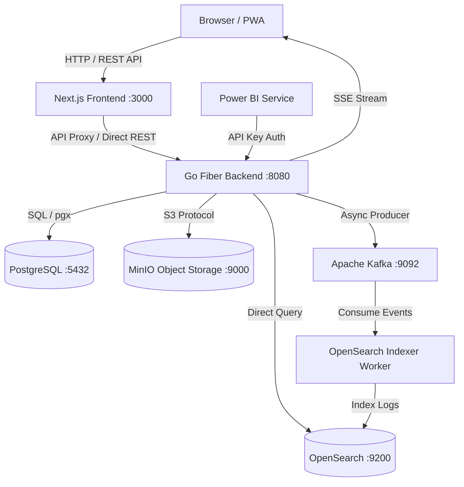
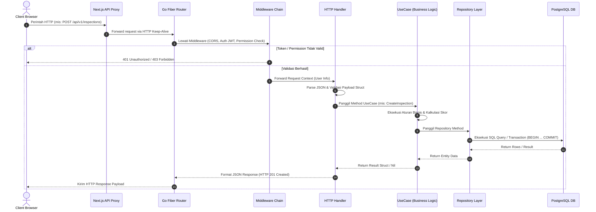
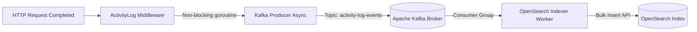
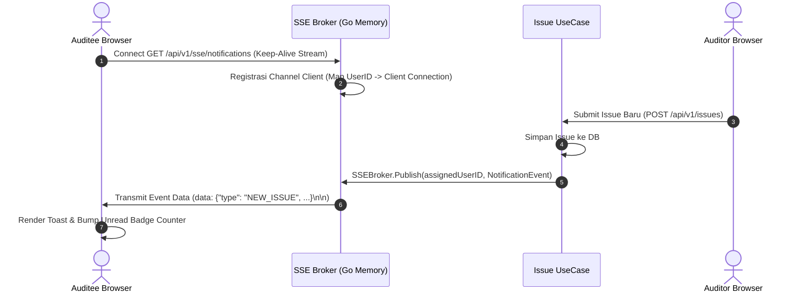
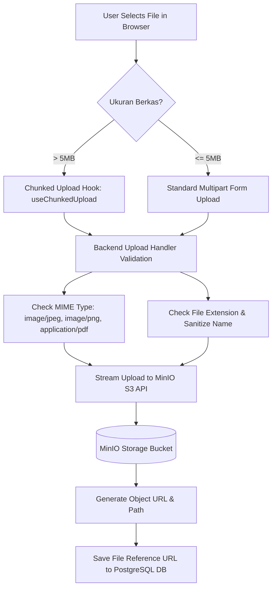
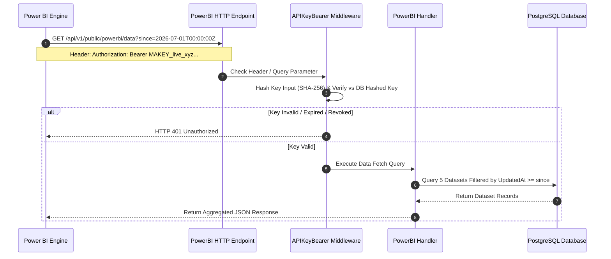

# System Architecture Documentation
# Sistem Audit Internal Perusahaan — Cimory Audit System

**Versi:** 1.0.0  
**Tanggal:** 2026-07-27  

---

## 1. High-Level Architecture Overview

**Cimory Audit System** dirancang menggunakan arsitektur *microservices-ready monolithic core* berkinerja tinggi. Sistem ini mengintegrasikan komponen frontend modern, backend berkinerja tinggi, database relasional, *object storage*, *event streaming broker*, serta mesin pencari analitik untuk mendukung seluruh siklus audit internal GMP secara *real-time*.

### 1.1 Diagram Arsitektur Utama



### 1.2 Penjelasan Peran Komponen Utama

| Komponen | Teknologi | Fungsi & Tanggung Jawab Utama |
|:---------|:----------|:------------------------------|
| **Browser / PWA** | Client-side Application | Antarmuka pengguna (auditor di lapangan & auditee) yang dapat diinstal sebagai Progressive Web App (PWA) dengan dukungan akses cepat dan notifikasi push. |
| **Frontend** | Next.js 15 (App Router) | Menyajikan antarmuka pengguna berbasis Server Components & Client Components, mengelola state aplikasi lokal, serta memfasilitasi komunikasi API. |
| **Backend** | Go (Golang) + Fiber Framework | Pusat pemrosesan logika bisnis, validasi request, pengelolaan otorisasi RBAC, manajemen transaksi database, dan orchestrator event. |
| **PostgreSQL** | PostgreSQL 15 | Database relasional utama (*Single Source of Truth*) yang menyimpan data transaksi audit, user, inspeksi, issue, WOWR, master data, dan preferensi sistem. |
| **MinIO** | MinIO Object Storage (S3 API) | Menyimpan berkas media seperti foto bukti temuan issue (*before/after*), dokumen lampiran audit, dan aset gambar secara terstruktur. |
| **Apache Kafka** | Apache Kafka 3.4 + Zookeeper | Message broker event-driven yang menampung *event log* secara *asynchronous* tanpa membebani response time request HTTP utama. |
| **OpenSearch** | OpenSearch 2.11 | Engine pencari dan agregasi log berkinerja tinggi yang mengindeks seluruh *activity log* untuk analisis investigasi audit trail secara cepat. |
| **Indexer Worker** | Go Async Consumer | Background worker yang membaca event log dari Kafka topic dan mengindeksnya ke dalam indeks OpenSearch secara otomatis. |
| **SSE Broker** | EventSource / HTTP Stream | Kanal komunikasi *real-time* satu arah dari backend ke browser pengguna untuk mentransmisikan notifikasi instan. |
| **Power BI Integration** | REST Public Endpoint | Endpoint khusus dengan autentikasi API Key aman yang menyajikan 5 dataset agregat audit untuk konsumsi analitik Business Intelligence eksekutif. |

---

## 2. Clean Architecture Backend Structure

Backend **Go Fiber** mengadopsi prinsip **Clean Architecture (Uncle Bob)** yang memisahkan tanggung jawab kode menjadi lapisan-lapisan (*layers*) independen. Hal ini menjamin bahwa logika bisnis tidak tergantung pada framework web, database, atau library pihak ketiga.

### 2.1 Struktural Direktori Backend

```
backend/
├── cmd/
│   └── server/
│       └── main.go          # Entry point utama aplikasi & pengisian dependency injection
├── config/                  # Konfigurasi aplikasi & pemuatan environment variables
├── router/                  # Pendaftaran rute HTTP & pemetaan handler
│   └── v1/                  # Grouping rute API v1 per fitur
└── internal/
    ├── domain/              # Business entities, struct data, & interface abstrak
    ├── usecase/             # Business logic layer (Application rules & orchestrator)
    ├── handler/             # Presentation layer (HTTP request parser & response builder)
    ├── infrastructure/
    │   └── persistence/     # Data access layer (Repository implementation PostgreSQL/GORM)
    └── middleware/          # Cross-cutting concerns (Auth, CORS, Logger, Permission, RateLimit)
```

### 2.2 Aturan Dependensi Lapangan (*Dependency Rules*)

```
  ┌─────────────────────────────────────────────────────────────┐
  │ Presentation Layer (HTTP Handlers & Routers)                │
  └──────────────────────────────┬──────────────────────────────┘
                                 │  memanggil
                                 ▼
  ┌─────────────────────────────────────────────────────────────┐
  │ Application Layer (UseCases / Business Logic)               │
  └──────────────────────────────┬──────────────────────────────┘
                                 │  tergantung pada
                                 ▼
  ┌─────────────────────────────────────────────────────────────┐
  │ Domain Layer (Entities & Repository Interfaces)             │
  └──────────────────────────────▲──────────────────────────────┘
                                 │  diimplementasikan oleh
  ┌──────────────────────────────┴──────────────────────────────┐
  │ Infrastructure Layer (Persistence GORM / Kafka / MinIO)     │
  └─────────────────────────────────────────────────────────────┘
```

1. **Domain Layer:** Berisi objek domain murni dan *interface* repository. Layer ini berada di pusat arsitektur dan **tidak boleh memprioritaskan atau memanggil layer lain**.
2. **UseCase Layer:** Mengandung logika bisnis murni aplikasi. Berinteraksi dengan layer domain via *interface* tanpa peduli bagaimana data disimpan secara fisik.
3. **Handler Layer:** Bertanggung jawab menerjemahkan request HTTP (JSON, Form Data) menjadi struct Go, memanggil UseCase, dan mengembalikan HTTP Response dengan status code yang sesuai.
4. **Infrastructure Layer:** Mengimplementasikan interface repository (misalnya query PostgreSQL menggunakan GORM, pengiriman file ke MinIO, atau push event ke Kafka).

---

## 3. Request Lifecycle Flow

Setiap HTTP request yang masuk dari peramban web pengguna melewati alur pemrosesan yang terstruktur secara ketat melalui lapisan-lapisan sistem:

### 3.1 Mermaid Sequence Diagram



### 3.2 Tahapan Pemrosesan Request Detail
1. **Network & Proxy:** Request dari client diterima oleh Next.js API Proxy atau langsung ke Go Fiber HTTP Server.
2. **Middleware Interception:** Request divalidasi urut melalui CORS, Rate Limiter, Logger, JWT Authenticator, dan Dynamic Permission Checker.
3. **Handler Binding & Validation:** Handler mengekstrak parameter/body, men-deserialize JSON ke struct DTO, dan mengeksekusi validasi aturan tipe data (`go-playground/validator`).
4. **UseCase Orchestration:** UseCase mengeksekusi logika bisnis (misalnya mengecek status area, membuat draf inspeksi, menautkan daftar uraian, dan mengkalkulasi skor).
5. **Database Transaction:** Repository melakukan operasi atomic `BEGIN TRANSACTION` $\rightarrow$ `INSERT/UPDATE` $\rightarrow$ `COMMIT` pada database PostgreSQL.
6. **Response Generation:** Result dikembalikan ke Handler untuk dibungkus ke dalam format standar JSON response `{ "success": true, "message": "...", "data": {...} }`.

---

## 4. Event-Driven Architecture for Activity Logging

Untuk memastikan catatan audit trail (*Activity Log*) tercatat lengkap tanpa memperlambat waktu respon (*response latency*) bagi pengguna, aplikasi menggunakan arsitektur **Event-Driven Asynchronous Logging** dengan Apache Kafka dan OpenSearch.

### 4.1 Log Pipeline Diagram



### 4.2 Alur Pemrosesan Log
1. **Completion Trigger:** Ketika handler HTTP selesai merespon request pengguna (status 2xx/4xx), `ActivityLogMiddleware` menyadap metadata request (User ID, IP Address, HTTP Method, Path, User-Agent, Execution Duration, Request Body).
2. **Asynchronous Dispatch:** Middleware meluncurkan *goroutine* baru (non-blocking) untuk mengemas payload event log ke dalam format JSON.
3. **Publish to Kafka:** Kafka Producer mempublikasikan pesan event tersebut ke topic `activity-log-events` secara *asynchronous*. Request HTTP pengguna langsung selesai tanpa menunggu proses pencatatan log.
4. **Consumer Worker Processing:** Program background worker (`OpenSearch Indexer Worker`) yang terpisah secara kontinyu membaca *stream event* dari topic Kafka.
5. **OpenSearch Indexing:** Worker mengumpulkan pesan dalam bentuk *batch* dan mengirimkannya ke indeks OpenSearch via Bulk API (`/audit-activity-logs/_bulk`) untuk siap dicari via dashboard admin.

---

## 5. Real-Time SSE (Server-Sent Events) Architecture

Sistem menggunakan **Server-Sent Events (SSE)** untuk mentransmisikan notifikasi instan secara *real-time* ke antarmuka pengguna (seperti notifikasi saat issue baru di-assign atau status follow-up diperbarui).

### 5.1 SSE Broker Design



### 5.2 Fitur & Spesifikasi SSE:
* **Connection Management:** `SSEBroker` mengelola koneksi HTTP long-polling per pengguna dalam memori (`sync.RWMutex` concurrent map).
* **Heartbeat Mechanism:** Mengirimkan *ping event* setiap 15 detik untuk mencegah koneksi diputus oleh proxy/firewall jaringan.
* **Auto-Reconnect Handling:** Frontend `useSSE` hook memantau status koneksi dan melakukan *reconnect* otomatis jika terjadi koneksi terputus (*network drop*).

---

## 6. File Upload Architecture

Pengunggahan foto bukti temuan issue dan dokumen tindak lanjut perbaikan didesain tahan terhadap ukuran berkas besar (*resilient*) menggunakan **MinIO Object Storage**.

### 6.1 Upload Workflow Diagram



### 6.2 MinIO Storage & URL Rules
* **Bucket Name:** `monitoring-audit-bucket`
* **Object Key Hierarchy:** `issues/{year}/{month}/{issue_id}/{uuid_filename}.png`
* **MinIO Storage URL Format:**  
  `http://minio:9000/monitoring-audit-bucket/issues/2026/07/ISSUE-8821/a8f1b2c3.jpg`
* **Fallback Storage:** Jika MinIO tidak dapat dijangkau, backend secara otomatis beralih menyimpan berkas ke direktori lokal `/app/uploads` (volume ter-mount).

---

## 7. Data Flow for Power BI Integration

Integrasi data analitik eksekutif dengan **Microsoft Power BI** dilakukan melalui endpoint REST API terenkripsi khusus yang mendukung *incremental data extraction*.

### 7.1 Data Flow Sequence



### 7.2 Spesifikasi 5 Datasets Power BI

Endpoint mengembalikan 5 dataset utama dalam satu payload JSON terstruktur:

1. **`inspections`:** Data header inspeksi (ID, Tanggal, Area, Kawasan, Total Score, Status Approval).
2. **`inspection_results`:** Rincian penilaian per item uraian checklist (Item ID, Status OK/NG/NA, Keterangan).
3. **`issues`:** Seluruh daftar temuan issue (Issue ID, Severity, Priority, Status, PIC User, Due Date).
4. **`wowr`:** Tracking Work Order dan Work Request terkait tindak lanjut perbaikan teknis.
5. **`master_summary`:** Pemetaan hierarki lengkap Master Area, Kawasan, Detail Kawasan, dan Aspek Audit.

---

## 8. Security Layers

Sistem menerapkan prinsip **Defense-in-Depth** dengan membentuk 6 lapisan keamanan berurutan untuk setiap request HTTP:

```
┌─────────────────────────────────────────────────────────────────┐
│ 1. CORS Policy Layer (Filter Origin Allowed & Methods)           │
├─────────────────────────────────────────────────────────────────┤
│ 2. Logger & Sanitization Layer (Sanitize Sensitive Headers/Body)│
├─────────────────────────────────────────────────────────────────┤
│ 3. Authentication Layer (JWT Signature Verification / API Key)  │
├─────────────────────────────────────────────────────────────────┤
│ 4. Permission Authorization Layer (RBAC + User Overrides)        │
├─────────────────────────────────────────────────────────────────┤
│ 5. Input Validation Layer (Struct Validation & XSS Sanitize)    │
├─────────────────────────────────────────────────────────────────┤
│ 6. Core Business Logic Handler Layer                            │
└─────────────────────────────────────────────────────────────────┘
```

1. **CORS Layer:** Membatasi domain mana saja yang diizinkan melakukan interaksi HTTP dengan backend API.
2. **Logger Layer:** Mencatat aktivitas sembari menghapus (*masking*) parameter sensitif seperti `password`, `token`, atau `encryption_key` dari log.
3. **Authentication Layer:** Menyadap header `Authorization: Bearer <token>` untuk mendekripsi token JWT dan memverifikasi tanggal kedaluwarsa.
4. **Permission Layer:** Memeriksa apakah role pengguna (Admin/Auditor/Auditee) atau user-level override memiliki hak akses spesifik (misal `INSPECTION_CREATE`).
5. **Validation Layer:** Menguji apakah struktur payload JSON bebas dari karakter berbahaya dan sesuai dengan standar tipe data.
6. **Handler Execution:** Kode bisnis dieksekusi setelah lolos seluruh 5 filter keamanan sebelumnya.

---

## 9. Frontend Architecture (Next.js 15)

Frontend **Next.js 15** dibangun menggunakan arsitektur modular modern berbasis **React 19** dan **TypeScript**:

```
frontend/src/
├── app/                      # App Router Hierarchy
│   ├── (auth)/               # Route Group: Autentikasi (Login, Forgot Password)
│   ├── (dashboard)/          # Route Group: Dashboard & Modul Bisnis Utama
│   ├── globals.css           # Styling Global (Tailwind CSS)
│   └── layout.tsx            # Root Layout Application
├── components/               # UI Components Library
│   ├── admin/                # Komponen khusus halaman Admin & Settings
│   ├── Inspection/           # Komponen form & checklist inspeksi
│   ├── isssues/              # Komponen detail issue, foto, & WOWR
│   ├── layout/               # Sidebar, Header, BottomNav, ScopeGuard
│   └── ui/                   # Reusable Primitive Components (Button, Modal, Input)
├── hooks/                    # Custom React Hooks (useSSE, useChunkedUpload, useAuth)
├── lib/                      # Helper Utilities & Axios Instance Setup
└── store/                    # Zustand Global State Management Stores
```

### 9.1 Fitur Arsitektural Frontend Utama

* **Next.js App Router & Server/Client Components:**
  * **Server Components:** Digunakan untuk render halaman statis, layout umum, dan penyajian data awal untuk mempercepat nilai *Largest Contentful Paint (LCP)*.
  * **Client Components:** Digunakan pada bagian interaktif seperti form checklist inspeksi, kompresi gambar client-side, dan real-time update widget.
* **Global State Management (Zustand):**
  Mengelola state terpusat untuk profil user login, daftar permission aktif, tema UI, dan antrean notifikasi tanpa *prop-drilling*.
* **Axios Interceptors:**
  * **Request Interceptor:** Otomatis menyuntikkan header `Authorization: Bearer <access_token>` pada setiap request keluar.
  * **Response Interceptor:** Menyadap error `401 Unauthorized` untuk mencoba pembaruan token otomatis (*refresh token*) secara transparan.
* **Real-Time Integration (`useSSE` Hook):**
  Hook khusus yang menginisialisasi `EventSource` ke endpoint SSE backend, mengelola status koneksi, dan meng-update counter notifikasi secara otomatis.
