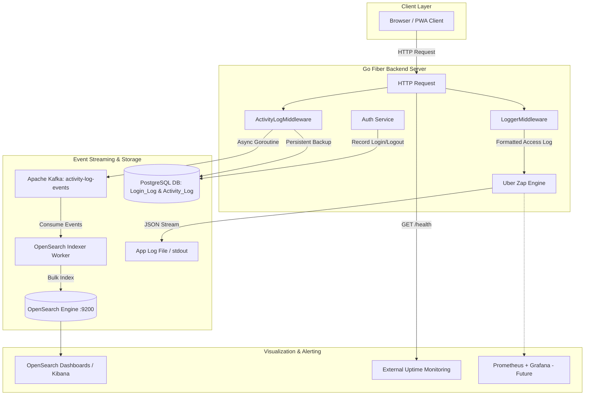
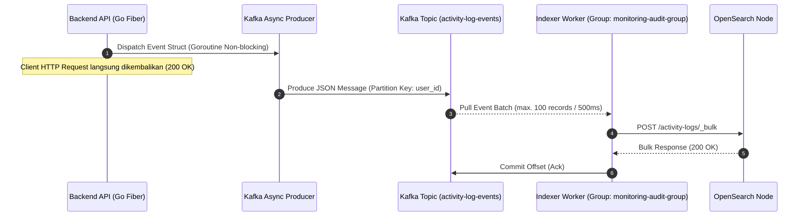

# Logging & Monitoring Plan — Cimory Audit System

**Versi:** 1.0.0  
**Tanggal:** 2026-07-27  

---

## 1. Logging Architecture Overview

Sistem Audit Internal Cimory mengadopsi strategi pencatatan log berlapis (*multi-tier logging strategy*) untuk mendukung aspek keterandalan (*reliability*), investigasi keamanan (*security forensic*), pemenuhan regulasi audit internal (*compliance*), serta pemantauan performa aplikasi secara *real-time*.

### 1.1 Diagram Arsitektur Logging & Monitoring



### 1.2 Ringkasan Komponen Logging

| Komponen Log | Library / Pipeline | Target Destinasi | Tujuan Utama |
|:---|:---|:---|:---|
| **Application Logs** | Uber Zap (`zap.Logger`) | `stdout` & `/var/log/audit/app.log` | Tracing internal error, startup sequence, DB query error, & background job execution. |
| **HTTP Access Logs** | Go Fiber `LoggerMiddleware` | Standard Output (`stdout`) | Mencatat seluruh traffic HTTP request/response beserta latency, status code, & IP client. |
| **Activity Audit Logs** | `ActivityLogMiddleware` $\rightarrow$ Kafka $\rightarrow$ OpenSearch | OpenSearch Index (`activity-logs`) & Tabel DB (`Activity_Log`) | Mencatat jejak audit interaksi pengguna (siapa, melakukan apa, kapan, pada resource mana). |
| **Login / Logout Logs** | Auth Handler Direct Service | Tabel Database `Login_Log` | Menjaga histori otentikasi user, melacak percobaan login gagal, & audit sesi pengguna. |

### 1.3 Aturan Klasifikasi Error Log
* **HTTP 4xx (Client Errors):** Dicatat sebagai **`WARN`** level. Menandakan kesalahan input pengguna, kegagalan otentikasi (401), atau akses dilarang (403). Hal ini bukan indikasi kegagalan sistem.
* **HTTP 5xx (Server Errors):** Dicatat sebagai **`ERROR`** level. Menandakan potensi bug pada aplikasi, koneksi database terputus, *unhandled panic*, atau *third-party service failure*. Memerlukan alur penanganan (*incident response*).

---

## 2. Log Levels and When to Use

Penggunaan level log diatur secara ketat agar tidak menimbulkan kebingungan (*log noise*) pada lingkungan produksi:

| Level Log | Deskripsi & Kriteria Penggunaan | Contoh Kasus Penggunaan di Cimory Audit System |
|:---|:---|:---|
| **`DEBUG`** | Informasi mendetail yang berguna untuk pengembangan (*development*) dan pelacakan bug teknis. Dieksekusi hanya pada environment `development` atau `staging`. | - Payload raw SQL query GORM.<br>- Parsing JSON payload yang sangat spesifik.<br>- Detail token handshake SSE connection. |
| **`INFO`** | Kejadian normal operasional sistem (*standard operational events*). Memberikan bukti bahwa fitur berjalan sesuai harapan. | - Aplikasi berhasil *startup* pada port `:8080`.<br>- User berhasil login / logout.<br>- Laporan inspeksi berhasil disimpan.<br>- Worker selesai mengindeks batch log. |
| **`WARN`** | Potensi masalah atau kondisi tidak ideal yang tidak menghentikan eksekusi aplikasi, namun perlu menjadi perhatian. | - Pengguna memasukkan password salah saat login (401).<br>- Akses endpoint tanpa permission yang cukup (403).<br>- Waktu respon panggilan MinIO lambat (> 2000ms).<br>- Retry attempt koneksi ke Kafka topic. |
| **`ERROR`** | Terjadi kegagalan fungsi aplikasi yang membutuhkan investigasi dan penanganan teknis oleh tim engineer. | - Database PostgreSQL terputus (*connection refused*).<br>- Gagal menyimpan berkas foto ke MinIO Object Storage.<br>- Unhandled Panic disadap oleh Fiber Recover Middleware.<br>- Gagal mempublikasikan event log ke Kafka broker. |

---

## 3. Activity Log Fields (Activity_Log Table)

Tabel `Activity_Log` pada PostgreSQL bertindak sebagai *persistent storage* tingkat tinggi untuk menyimpan jejak audit aktivitas sensitif.

### 3.1 Dokumentasi Field Tabel `Activity_Log`

| Nama Field | Tipe Data | Nullable | Deskripsi & Nilai yang Ditangkap |
|:---|:---|:---|:---|
| `id` | `BIGINT (PK)` | No | Auto-increment primary key unik untuk setiap entry log. |
| `user_id` | `BIGINT (FK)` | Yes | ID pengguna yang melakukan aksi (`null` jika tidak terautentikasi/system task). |
| `user_name` | `VARCHAR(100)` | Yes | Nama lengkap pengguna pada saat aksi dilakukan. |
| `user_role` | `VARCHAR(50)` | Yes | Role pengguna aktif saat melakukan aksi (cth: `ADMIN`, `AUDITOR`, `AUDITEE`). |
| `action` | `VARCHAR(100)` | No | Kata kerja aksi dalam huruf kapital (cth: `CREATE_INSPECTION`, `RESOLVE_ISSUE`, `REVOKE_API_KEY`). |
| `module` | `VARCHAR(50)` | No | Nama modul bisnis terkait (cth: `INSPECTION`, `ISSUE`, `IAM`, `API_KEY`, `SETTING`). |
| `target_id` | `VARCHAR(100)` | Yes | ID atau identifier dari entitas objek yang menjadi target aksi (cth: `INSP-2026-001`, `882`). |
| `description` | `TEXT` | No | Deskripsi manusiawi yang menjelaskan secara gamblang aksi yang dilakukan. |
| `ip_address` | `VARCHAR(45)` | No | Alamat IP IPv4/IPv6 asal request client (`X-Forwarded-For` / Client IP). |
| `user_agent` | `VARCHAR(255)` | Yes | User-Agent string dari browser/perangkat client. |
| `payload` | `JSONB` | Yes | Snapshot data JSON pendukung (state sebelum/sesudah, parameter perubahan, query filter). |
| `created_at` | `TIMESTAMPTZ` | No | Timestamp presisi tinggi (`microsecond`) kapan aksi tercatat oleh server. |

### 3.2 Contoh Entri Log untuk Berbagai Aksi Audit

#### A. Aksi Audit: Membuat Inspeksi Baru (`CREATE_INSPECTION`)
```json
{
  "id": 10452,
  "user_id": 12,
  "user_name": "Budi Santoso",
  "user_role": "AUDITOR",
  "action": "CREATE_INSPECTION",
  "module": "INSPECTION",
  "target_id": "INSP-2026-07-089",
  "description": "Auditor Budi Santoso membuat inspeksi baru di Area Processing Dairy Plant A",
  "ip_address": "10.20.4.15",
  "user_agent": "Mozilla/5.0 (Macintosh; Intel Mac OS X 10_15_7) AppleWebKit/537.36",
  "payload": {
    "area_id": 4,
    "kawasan_id": 12,
    "total_items": 45,
    "scheduled_date": "2026-07-27"
  },
  "created_at": "2026-07-27T09:15:30.123456Z"
}
```

#### B. Aksi Audit: Resolusi Temuan Issue (`RESOLVE_ISSUE`)
```json
{
  "id": 10453,
  "user_id": 8,
  "user_name": "Siti Rahma",
  "user_role": "AUDITOR",
  "action": "RESOLVE_ISSUE",
  "module": "ISSUE",
  "target_id": "ISS-8812",
  "description": "Auditor Siti Rahma memverifikasi dan menutup temuan issue 'Kebocoran Pipa Steam'",
  "ip_address": "10.20.4.18",
  "user_agent": "Mozilla/5.0 (iPhone; CPU iPhone OS 17_4 like Mac OS X) Mobile/15E148",
  "payload": {
    "issue_id": "ISS-8812",
    "previous_status": "PENDING_VALIDATION",
    "new_status": "RESOLVED",
    "verification_note": "Tindak lanjut foto perbaikan sudah sesuai dengan standar GMP."
  },
  "created_at": "2026-07-27T10:42:12.876543Z"
}
```

---

## 4. HTTP Access Log Fields (from LoggerMiddleware)

Setiap HTTP Request yang diproses oleh Go Fiber router akan melewati `LoggerMiddleware` dan dicatat secara terstruktur.

### 4.1 Parameter Field HTTP Access Log

| Field Name | Description | Example Value |
|:---|:---|:---|
| `timestamp` | Waktu penerimaan request ISO 8601 | `2026-07-27T08:47:32.102Z` |
| `method` | HTTP Method yang digunakan | `POST`, `GET`, `PUT`, `DELETE` |
| `path` | Request Endpoint URI | `/api/v1/inspections/42/complete` |
| `query` | URL Query parameters | `page=1&limit=10&status=OPEN` |
| `status` | HTTP Response Status Code | `200`, `201`, `400`, `403`, `500` |
| `ip` | Client IP Address | `192.168.1.105` |
| `latency` | Durasi pemrosesan internal server | `14.52ms` |
| `user_agent` | Browser / Client identifier string | `CimoryAuditPWA/1.0.0` |
| `user_id` | ID pengguna jika terautentikasi JWT | `15` (atau `0` jika anonim) |

### 4.2 Aturan Pencatatan Level HTTP Access Log
* **HTTP Status 2xx / 3xx:** Level **`INFO`**
* **HTTP Status 4xx:** Level **`WARN`**
* **HTTP Status 5xx:** Level **`ERROR`**

---

## 5. OpenSearch Index Structure

OpenSearch digunakan untuk menyimpan seluruh pencatatan *Activity Log* dan *HTTP Access Log* demi performa pencarian kilat (*full-text search*) dan analitik agregasi log.

### 5.1 Spesifikasi Indeks & Mapping Schema

* **Nama Indeks:** `activity-logs`
* **Number of Shards:** `2`
* **Number of Replicas:** `1`

#### JSON Mapping Definition (`activity-logs-mapping.json`):
```json
{
  "settings": {
    "index": {
      "number_of_shards": 2,
      "number_of_replicas": 1,
      "refresh_interval": "5s"
    }
  },
  "mappings": {
    "properties": {
      "@timestamp": { "type": "date" },
      "id": { "type": "long" },
      "user_id": { "type": "keyword" },
      "user_name": { 
        "type": "text",
        "fields": { "keyword": { "type": "keyword", "ignore_above": 256 } }
      },
      "user_role": { "type": "keyword" },
      "action": { "type": "keyword" },
      "module": { "type": "keyword" },
      "target_id": { "type": "keyword" },
      "description": { "type": "text" },
      "ip_address": { "type": "ip" },
      "user_agent": { "type": "text" },
      "http_method": { "type": "keyword" },
      "http_path": { "type": "keyword" },
      "http_status": { "type": "integer" },
      "latency_ms": { "type": "float" },
      "payload": { "type": "object", "enabled": true }
    }
  }
}
```

### 5.2 Recommendations for Retention Policy
* **Active Index Lifecycle Management (ISM):**
  * **Hot Phase:** 0 - 30 hari (Read/Write aktif, fast SSD).
  * **Warm Phase:** 31 - 90 hari (Read only, dikompresi).
  * **Delete Phase:** > 90 hari (Indeks otomatis di-drop dari OpenSearch; data permanen tetap aman di database PostgreSQL `Activity_Log`).

### 5.3 Sample OpenSearch / Kibana Dashboard Queries

#### A. Pencarian Aktivitas Pengguna Spesifik (Lucene Query)
```lucene
user_id: "12" AND module: "ISSUE" AND action: "RESOLVE_ISSUE"
```

#### B. Agregasi Error Rate (JSON DSL Query)
```json
{
  "size": 0,
  "query": {
    "range": {
      "@timestamp": {
        "gte": "now-24h",
        "lte": "now"
      }
    }
  },
  "aggs": {
    "errors_by_module": {
      "filter": { "range": { "http_status": { "gte": 400 } } },
      "aggs": { "by_module": { "terms": { "field": "module" } } }
    }
  }
}
```

---

## 6. Kafka Activity Log Pipeline

Pencatatan log menggunakan alur pemrosesan event terpisah (*asynchronous event pipeline*) untuk menghindari *latency degradation* pada response time API utama.

### 6.1 Detail Komponen Pipeline



* **Topic Name:** `activity-log-events`
* **Partitions:** 3 Partitions
* **Replication Factor:** 2
* **Producer:** Backend `ActivityLogMiddleware` (Go `confluent-kafka-go` / `sarama` async goroutine).
* **Consumer Worker:** Dedicated Go Background Process (`cmd/indexer/main.go`).
* **Consumer Group:** `monitoring-audit-group`
* **Message Format:** Standard JSON String.

---

## 7. Health Monitoring

### 7.1 Health Check Endpoint (`GET /health`)

Backend menyediakan endpoint publik `/health` yang dapat diakses oleh load balancer, Docker, atau platform monitoring eksternal.

#### HTTP Response Status: `200 OK`
```json
{
  "status": "ok",
  "service": "MonitoringAudit",
  "version": "1.0.0",
  "timestamp": "2026-07-27T08:47:32Z",
  "components": {
    "database": "up",
    "kafka": "up",
    "minio": "up",
    "opensearch": "up"
  }
}
```

### 7.2 Docker Container Healthcheck Configuration

Dalam file `docker-compose.yml`, setiap service dilengkapi instruksi healthcheck otomatis:

```yaml
services:
  backend:
    image: ghcr.io/cimory/audit-backend:latest
    healthcheck:
      test: ["CMD", "curl", "-f", "http://localhost:8080/health"]
      interval: 10s
      timeout: 5s
      retries: 3
      start_period: 15s

  postgres:
    image: postgres:15-alpine
    healthcheck:
      test: ["CMD-SHELL", "pg_isready -U postgres -d monitoring_audit"]
      interval: 10s
      timeout: 5s
      retries: 5

  kafka:
    image: confluentinc/cp-kafka:7.4.0
    healthcheck:
      test: ["CMD-SHELL", "kafka-topics.sh --bootstrap-server localhost:9092 --list"]
      interval: 15s
      timeout: 10s
      retries: 3
```

### 7.3 External & Future Monitoring Recommendations
1. **External Uptime Monitoring:** Menggunakan **UptimeRobot** atau **Pingdom** untuk melakukan HTTP ping setiap 60 detik ke endpoint `https://audit.cimory.com/health`.
2. **Prometheus + Grafana (Roadmap Masa Depan):** Menambahkan Prometheus Client Handler (`/metrics`) untuk mengekspos metrik runtime Go (memory allocation, goroutine count, GC pause time, HTTP throughput).

---

## 8. Recommended Alert Rules

Aturan peringatan (*alert rules*) dikonfigurasikan pada OpenSearch Monitor / Grafana Alerting untuk memberikan notifikasi instan ke Slack Tim Engineering / Email DevOps.

| Nama Alert | Metrik / Kondisi | Ambang Batas (*Threshold*) | Window Evaluasi | Tingkat Keparahan | Channel Notifikasi |
|:---|:---|:---|:---|:---|:---|
| **High 5xx Error Rate** | HTTP Status 5xx count | > 10 error / menit | 1 menit | **CRITICAL** | Slack `#audit-alerts` + PagerDuty |
| **Database Connection Failure** | Database health status pada `/health` | Status != `up` | 30 detik | **CRITICAL** | Slack `#audit-alerts` + SMS On-Call |
| **Kafka Consumer Lag Spike** | Lag consumer group `monitoring-audit-group` | > 1000 messages | 5 menit | **WARNING** | Email DevOps + Slack `#audit-alerts` |
| **High Disk Usage** | Volume storage (`/var/lib/docker`) | > 80% kapasitas | 5 menit | **WARNING** | Email System Admin |
| **High RAM Utilization** | Container RAM usage | > 90% selama 5 menit | 5 menit | **WARNING** | Slack `#audit-alerts` |

---

## 9. Log Retention Policy

Untuk memenuhi kepatuhan hukum dan efisiensi penyimpanan fisik server, kebijakan retensi log diatur sebagai berikut:

```
┌────────────────────────────────────────────────────────────────────────┐
│ Log Retention Summary                                                  │
├─────────────────────────┬──────────────────┬───────────────────────────┤
│ Tipe Log                │ Periode Retensi  │ Media Penyimpanan         │
├─────────────────────────┼──────────────────┼───────────────────────────┤
│ Application Log File    │ 30 Hari          │ Local Server Disk Log     │
│ Activity Log (Database) │ Permanen         │ PostgreSQL (Activity_Log) │
│ OpenSearch Index        │ 90 Hari          │ OpenSearch Storage Index  │
│ Login / Logout Log      │ 1 Tahun          │ PostgreSQL (Login_Log)    │
└─────────────────────────┴──────────────────┴───────────────────────────┘
```

---

## 10. Log Access Control

Sesuai dengan prinsip *Least Privilege*, hak akses terhadap data log dibatasi secara ketat:

1. **Akses UI Modul Audit Log Aplikasi:**
   - Diatur melalui sistem RBAC internal aplikasi.
   - Hanya pengguna dengan permission `MOD-LOG READ` (Default: System Admin & Lead Auditor) yang dapat membuka halaman `/admin/activity-logs`.
2. **Akses OpenSearch Dashboards (Kibana):**
   - Hanya dapat diakses melalui jaringan internal VPN Cimory.
   - Terautentikasi via akun khusus Admin / DevOps Team.
3. **Akses File Log Fisik di Server:**
   - File log pada `/var/log/audit/*.log` hanya dapat dibaca oleh user Linux `sysadmin` dengan hak `chmod 600`.

---

## 11. Sample Log Entries Format

### 1. Uber Zap Application Log (`ERROR` Format)
```json
{
  "level": "error",
  "ts": "2026-07-27T08:47:32.456+0700",
  "caller": "persistence/inspection_repository.go:142",
  "msg": "failed to commit inspection transaction",
  "inspection_id": "INSP-2026-07-089",
  "error": "pq: insert or update on table \"inspection_results\" violates foreign key constraint \"fk_items\"",
  "stacktrace": "main.go:45\nrouter/v1/router.go:88\nhandler/inspection_handler.go:112"
}
```

### 2. HTTP Access Log (Fiber Logger Format)
```json
{
  "timestamp": "2026-07-27T08:47:32.501Z",
  "level": "INFO",
  "method": "POST",
  "path": "/api/v1/inspections/89/complete",
  "status": 200,
  "latency": "24.15ms",
  "ip": "10.20.4.15",
  "user_agent": "Mozilla/5.0 (Macintosh; Intel Mac OS X 10_15_7)",
  "user_id": 12
}
```

---

## 12. Monitoring Dashboard Recommendations

Visualisasi dashboard OpenSearch Dashboards disarankan mencakup 5 komponen widget utama:

```
┌─────────────────────────────────────────────────────────────────────────┐
│ CIMORY AUDIT SYSTEM — OPERATIONAL MONITORING DASHBOARD                  │
├────────────────────────────────────┬────────────────────────────────────┤
│ 1. HTTP Request Rate by Status     │ 2. Top 10 API Endpoints            │
│    [Stacked Area Chart: 2xx/4xx/5xx]│    [Horizontal Bar Chart]          │
├────────────────────────────────────┼────────────────────────────────────┤
│ 3. Error Rate Trend (4xx & 5xx)    │ 4. User Activity Heatmap           │
│    [Line Chart with Alert Line]    │    [Grid Matrix: Hour vs Day]      │
├────────────────────────────────────┴────────────────────────────────────┤
│ 5. Issue Creation vs Resolution Rate                                   │
│    [Dual-Line Metric Graph]                                             │
└─────────────────────────────────────────────────────────────────────────┘
```

1. **HTTP Request Rate by Status Code:** Stacked area chart yang menampilkan volume traffic per detik, dikelompokkan berdasarkan warna status (Hijau = 2xx, Kuning = 4xx, Merah = 5xx).
2. **Top 10 API Endpoints by Call Frequency:** Bar chart horizontal yang mengurutkan rute API yang paling sering dipanggil oleh peramban pengguna.
3. **Error Rate Trend:** Chart garis yang memantau persentase error real-time untuk mendeteksi lonjakan anomali (*anomaly spikes*).
4. **User Activity Heatmap:** Heatmap jam vs hari yang menunjukkan puncak intensitas aktivitas pengguna auditor di lapangan.
5. **Issue Creation vs Resolution Rate:** Grafik komparatif yang memperlihatkan laju penemuan temuan baru (*issues created*) dibandingkan laju penyelesaian perbaikan (*issues resolved*).
