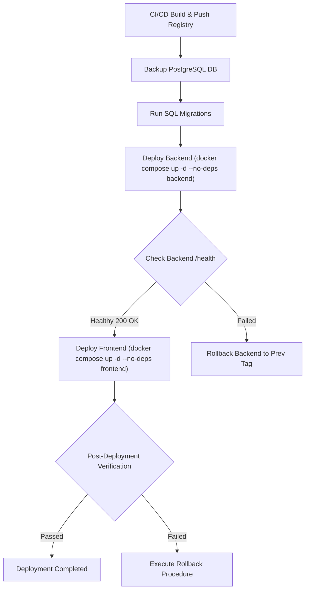

# Deployment & Rollback Plan — Cimory Audit System

**Versi:** 1.0.0  
**Tanggal:** 2026-07-27  

---

## 1. Deployment Overview

Sistem Audit Internal Cimory didesain untuk didistribusikan menggunakan kontainerisasi **Docker Compose**. Strategi penyebaran (*deployment strategy*) difokuskan pada keandalan, keamanan konfigurasi, serta minimalisasi *downtime* operasional audit melalui pendekatan `--no-deps` service update.

### 1.1 Diagram Alur Deployment



### 1.2 Lingkungan Deployment (Environment Architecture)
* **Development Environment:** Pengujian lokal oleh tim pengembang menggunakan mock storage dan database lokal.
* **Staging Environment:** Cermin persis dari environment produksi untuk pengujian regresi automatik, pengujian migrasi database, dan *user acceptance test (UAT)*.
* **Production Environment:** Server berkinerja tinggi yang menjalankan seluruh *stack* kontainer Docker (Backend Go Fiber, Frontend Next.js, PostgreSQL, MinIO, Kafka, Zookeeper, OpenSearch, Worker Indexer).

---

## 2. Pre-Deployment Checklist

Sebelum mengeksekusi instruksi deployment ke lingkungan produksi, tim DevOps & Developer penanggung jawab wajib mengonfirmasi checklist berikut:

- [ ] **CI/CD Build & Tests:** Seluruh *automated unit test* dan *integration test* berhasil (*PASS*) pada pipeline GitHub Actions.
- [ ] **Docker Registry Image:** Docker images backend dan frontend versi rilis terbaru telah berhasil di-build dan di-push ke GitHub Container Registry (`ghcr.io`).
- [ ] **Database Backup:** Backup snapshot database PostgreSQL produksi terbaru telah dibuat via `pg_dump` dan diverifikasi integritas ukurannya.
- [ ] **Environment File (.env):** File `.env` pada server produksi telah diverifikasi dan dicocokkan dengan kebutuhan variabel lingkungan rilis terbaru.
- [ ] **Review SQL Migration:** Skrip perubahan skema database (`backend/migrations/*.sql`) telah ditinjau dan lolos ujicoba di environment staging.
- [ ] **Rollback Preparedness:** Tag versi Docker image sebelumnya disiapkan dan instruksi rollback siap dieksekusi jika terjadi kondisi darurat.
- [ ] **Stakeholder Notification:** Pengumuman *maintenance window* (jika ada pemeliharaan terencana) telah dikirimkan ke pengguna internal (Tim Quality Control / Audit).

---

## 3. Production Deployment Steps (Step by Step)

Prosedur deployment produksi dilakukan secara bertahap dan terstruktur untuk meminimalisir risiko kegagalan sistem.

### Step 1: SSH ke Server Produksi
```bash
ssh sysadmin@prod-audit.cimory.com -i ~/.ssh/cimory_prod_rsa
```

### Step 2: Masuk ke Direktori Proyek
```bash
cd /opt/cimory-audit-system
```

### Step 3: Pull Kode Sumber Terbaru
```bash
git pull origin main
```

### Step 4: Pull Docker Images Terbaru dari Registry
```bash
docker compose pull
```

### Step 5: Jalankan Migrasi Database PostgreSQL (jika ada)
```bash
# Lakukan backup sebelum eksekusi migrasi
docker exec -t monitoring_db pg_dump -U postgres -Fc monitoring_audit > ./backups/backup_pre_migration_$(date +%Y%m%d_%H%M%S).dump

# Jalankan skrip migrasi SQL terbaru
docker exec -i monitoring_db psql -U postgres -d monitoring_audit < ./backend/migrations/v1.1.0_add_indexes.sql
```

### Step 6: Deploy Backend Service tanpa Mengganggu Service Lain
```bash
docker compose up -d --no-deps backend
```

### Step 7: Verifikasi Health Check Backend
```bash
curl -i http://localhost:8080/health
# Pastikan mengembalikan HTTP/1.1 200 OK dengan {"status":"ok"}
```

### Step 8: Deploy Frontend Service
```bash
docker compose up -d --no-deps frontend
```

### Step 9: Verifikasi Frontend Health
```bash
curl -i http://localhost:3000
# Pastikan mengembalikan HTTP/1.1 200 OK
```

### Step 10: Pantau Log Aplikasi secara Real-time
```bash
docker compose logs -f --tail=100 backend frontend
```

---

## 4. Docker Image Versioning

Sistem menerapkan penamaan tag Docker Image yang konsisten dan teracak mengikuti standar **Semantic Versioning (SemVer)**:

### 4.1 Tag Format Strategy
* **Backend Image Tag:** `ghcr.io/cimory/audit-backend:vX.Y.Z` dan `ghcr.io/cimory/audit-backend:latest`
* **Frontend Image Tag:** `ghcr.io/cimory/audit-frontend:vX.Y.Z` dan `ghcr.io/cimory/audit-frontend:latest`

### 4.2 Aturan Manajemen Image Tag
1. **Multi-tagging:** Setiap build image wajib diberi tag versi spesifik (`v1.0.0`, `v1.0.1`) DAN tag `:latest`.
2. **Retensi Image Lokal:** Server produksi **WAJIB** menyimpan minimal **3 versi rilis image sebelumnya** pada lokal Docker image storage untuk mempercepat alur *instant rollback* tanpa perlu mendownload ulang dari internet:
   ```bash
   # Contoh image yang tersimpan di server produksi
   ghcr.io/cimory/audit-backend:v1.0.0
   ghcr.io/cimory/audit-backend:v0.9.9
   ghcr.io/cimory/audit-backend:v0.9.8
   ```

---

## 5. Database Migration Deployment

Perubahan skema database PostgreSQL merupakan tahapan paling kritis dalam alur deployment.

### 5.1 Rules & Procedures:
1. **Lokasi Script Migration:** Seluruh berkas SQL disimpan teratur pada direktori `backend/migrations/` dengan penamaan kronologis (cth: `202607270001_create_login_log.sql`).
2. **Timing Execution:** Migrasi SQL **WAJIB dieksekusi SEBELUM** kontainer versi backend baru diaktifkan (`docker compose up`).
3. **Imutabilitas File:** File migrasi yang sudah pernah berjalan di lingkungan produksi **TIDAK BOLEH** diubah atau dihapus. Perubahan skema lanjutan harus menggunakan file migrasi baru (`ALTER TABLE`).
4. **Mandatory Backup:** Pembuatan backup *snapshot* wajib dilakukan tepat sebelum perintah migrasi dijalankan:
   ```bash
   pg_dump -U postgres -d monitoring_audit -F c -b -v -f ./backups/backup_$(date +%Y%m%d_%H%M%S).sql
   ```

---

## 6. Configuration Management

Pengelolaan konfigurasi sistem memisahkan secara tegas antara kode aplikasi dan data rahasia (*secrets management*).

### 6.1 Server Environment File (`.env`)
* **Strict Rule:** File `.env` **TIDAK BOLEH** dimasukkan (*committed*) ke dalam repositori Git. File `.gitignore` wajib mengecualikan `.env`.
* **Dilarang keras:** Menyimpan credential/secret secara *hardcoded* di dalam `docker-compose.yml`.

### 6.2 Variabel Lingkungan Kritis (*Critical Environment Variables*)

| Variabel Lingkungan | Deskripsi / Fungsi | Penanganan Risiko Keamanan |
|:---|:---|:---|
| `JWT_SECRET` | Secret key penandatanganan token otentikasi JWT. | Rahasia tingkat tinggi. Pengubahan/rotasi variabel ini akan menyebabkan **seluruh sesi login user aktif menjadi invalid** secara seketika. |
| `DB_PASSWORD` | Password akun PostgreSQL master. | Diacak menggunakan 32 karakter alfanumerik acak. |
| `SETTING_ENCRYPTION_KEY` | Key enkripsi AES-256 untuk mengenkripsi value sensitif di tabel `System_Setting`. | Wajib di-backup terpisah di Password Manager aman. |
| `MINIO_SECRET_KEY` | Private access key MinIO Object Storage. | Digunakan oleh backend untuk mengunggah bukti perbaikan. |

---

## 7. Rollback Procedure

Jika ditemukan bug kritis atau kegagalan sistem setelah deployment di lingkungan produksi, tim penanggung jawab wajib memilih skenario rollback yang sesuai:

### 7.1 Kriteria Keputusan Rollback (Rollback Decision Criteria)
Rollback **WAJIB** segera dieksekusi apabila memenuhi salah satu kriteria berikut:
1. Persentase HTTP 5xx Error Rate > 5% selama 5 menit berturut-turut.
2. Endpoint Health Check (`GET /health`) gagal mengembalikan HTTP 200 selama 3 kali percobaan beruntun (interval 10 detik).
3. Terdeteksi adanya kerusakan atau korupsi data (*data corruption*) pasca migrasi skema.
4. Terjadi pemutusan koneksi total (*total service outage*) yang tidak bisa diatasi dalam waktu 15 menit.

### 7.2 Skenario Rollback 1: Isu Hanya Pada Service Backend
Terjadi bug pada logika bisnis Go Fiber, namun skema database tidak mengalami perubahan:
```bash
# 1. Hentikan kontainer backend bermasalah
docker compose stop backend

# 2. Deploy ulang backend menggunakan tag versi stabil sebelumnya
IMAGE_BACKEND=ghcr.io/cimory/audit-backend:v1.0.0 docker compose up -d --no-deps backend

# 3. Pantau log backend untuk memastikan stabilitas
docker compose logs -f --tail=50 backend
```

### 7.3 Skenario Rollback 2: Isu Migrasi Database PostgreSQL
Terjadi kegagalan pada skrip migrasi SQL atau perbedaan struktur yang merusak fungsionalitas:
```bash
# 1. Immediately stop backend service untuk menghentikan write transaction
docker compose stop backend

# 2. Restore database PostgreSQL dari backup snapshot pre-deployment
docker exec -i monitoring_db psql -U postgres -d monitoring_audit < ./backups/backup_pre_migration_YYYYMMDD_HHMMSS.sql

# 3. Kembalikan image backend ke versi stabil sebelumnya
docker compose up -d --no-deps backend

# 4. Verifikasi ulang integritas data
docker exec -it monitoring_db psql -U postgres -d monitoring_audit -c "SELECT COUNT(*) FROM users;"
```

### 7.4 Skenario Rollback 3: Total System Failure (Full Stack Rollback)
Terjadi kegagalan masif pada versi rilis secara keseluruhan:
```bash
# 1. Hentikan seluruh stack aplikasi
docker compose down

# 2. Revert repositori git ke tag rilis sebelumnya
git checkout v1.0.0

# 3. Jalankan kembali seluruh stack service
docker compose up -d --build

# 4. Lakukan smoke testing penuh
```

---

## 8. Blue-Green Deployment (Future Recommendation)

Untuk mendukung pembaruan sistem **Zero-Downtime 100%** di masa mendatang, disarankan mengimplementasikan pola **Blue-Green Deployment**:

```mermaid
flowchart LR
    Router[Nginx Reverse Proxy / Load Balancer]
    subgraph Blue Environment ["Environment Blue (Active Live v1.0.0)"]
        BackendBlue[Go Backend :8080]
        FrontendBlue[Next.js Frontend :3000]
    end
    subgraph Green Environment ["Environment Green (New Release v1.1.0)"]
        BackendGreen[Go Backend :8081]
        FrontendGreen[Next.js Frontend :3001]
    end

    Router -->|Current Traffic| Blue Environment
    Router -.->|Switch Traffic after Verification| Green Environment
```

* **Mekanisme Workflows:**
  1. Lingkungan **Blue** melayani traffic produksi aktif.
  2. Versi rilis baru di-deploy ke lingkungan **Green** secara terisolasi.
  3. Tim QA mengeksekusi *automated smoke tests* pada lingkungan Green.
  4. Setelah diverifikasi 100% sehat, Nginx Reverse Proxy memperbarui konfigurasi upstream (*traffic switch*) dari Blue ke Green secara instant tanpa ada permohonan HTTP client yang dropped.

---

## 9. Post-Deployment Verification Checklist

Setelah proses deployment atau rollback selesai dilakukan, wajib dilakukan pengujian cepat (*Smoke Testing*) sesuai instruksi berikut:

- [ ] **Health Endpoint Check:** Memastikan `curl -i http://localhost:8080/health` mengembalikan status `200 OK`.
- [ ] **Authentication Check:** Pengujian fungsi Login user (Admin, Auditor, Auditee) berhasil mendapatkan JWT Token.
- [ ] **Dashboard Loading:** Memastikan halaman utama dashboard memuat metrik inspeksi dan ringkasan issue tanpa error Javascript console.
- [ ] **File Upload Verification:** Pengujian upload foto bukti perbaikan issue berhasil terkirim dan dapat diakses dari MinIO Object Storage.
- [ ] **Real-time SSE Notification:** Memastikan koneksi SSE (`/api/v1/sse/notifications`) terhubung lancar dan indikator badge notifikasi berfungsi.
- [ ] **Power BI Endpoint Accessibility:** Pengujian query data Power BI dengan header Bearer API Key mengembalikan JSON dataset yang valid.
- [ ] **Log Flow Verification:** Memastikan log aktivitas baru mengalir lancar dari backend $\rightarrow$ Kafka $\rightarrow$ OpenSearch Index.

---

## 10. Emergency Contacts and Escalation Matrix

Jika terjadi kendala kritis saat deployment di luar *maintenance window*, skema eskalasi berikut harus diikuti:

| Tingkat Escalation | Peran / Jabatan | Kontak Emergency | Tanggung Jawab & Scope |
|:---|:---|:---|:---|
| **Level 1** | Developer on Duty | `dev-oncall@cimory.com` / Slack `@dev-oncall` | Menangani pertolongan pertama, mengeksekusi instruksi deployment, & melakukan restart container. |
| **Level 2** | Lead Software Engineer | `lead-eng@cimory.com` / HP: +62-811-XXXX-111 | Mengambil keputusan rollback skema database & koordinasi patch darurat (*hotfix*). |
| **Level 3** | Head of IT / CTO | `cto-office@cimory.com` / HP: +62-811-XXXX-999 | Komunikasi ke jajaran manajemen eksekutif & persetujuan *extended downtime*. |
