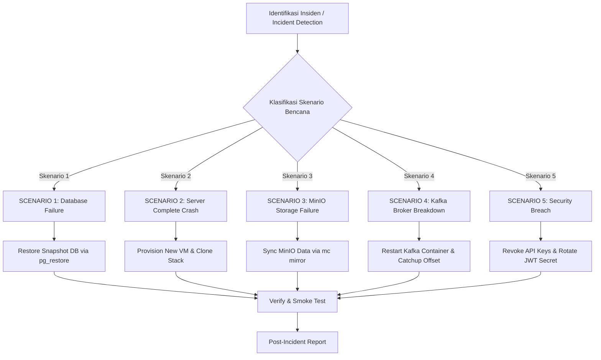

# Disaster Recovery (DR) Plan — Cimory Audit System

**Versi:** 1.0.0  
**Tanggal:** 2026-07-27  

---

## 1. DR Objectives

Dokumen *Disaster Recovery (DR) Plan* ini dirancang untuk memastikan kesiapsiagaan dan keberlanjutan operasional (*business continuity*) Sistem Audit Internal Cimory ketika menghadapi insiden kritis, kegagalan infrastruktur masif, atau bencana alam.

### 1.1 Key Performance Metrics (RTO & RPO)
* **Recovery Time Objective (RTO):** Target waktu maksimal pemulihan sistem hingga kembali beroperasi secara normal adalah **< 4 jam**.
* **Recovery Point Objective (RPO):** Target maksimal kehilangam data yang ditoleransi adalah **< 24 jam** (berdasarkan penjadwalan *daily backup*).
* **Tujuan Utama:** Memastikan sistem dapat dipulihkan secara cepat, terstruktur, dan aman dengan risiko kehilangan data audit (*data loss*) minimal.

---

## 2. Risk Classification Matrix

Tabel berikut mengidentifikasi potensi risiko teknis dan infrastruktur beserta mitigasi pencegahannya:

| Potensi Risiko / Threat | Probabilitas | Dampak (*Impact*) | Strategi Mitigasi Utama |
|:---|:---|:---|:---|
| **Database Corruption / Data Loss** | Low | Critical | Backup PostgreSQL harian, transaksi ACID, penjelajahan point-in-time restore. |
| **Server Hardware Crash / VPS Outage** | Medium | High | Docker restart policy (`always`), pemantauan healthcheck otomatis, snapshot VM harian. |
| **MinIO Storage Failure (Media Loss)** | Low | High | Backup volume MinIO mingguan, skema sinkronisasi `mc mirror`, fallback lokal. |
| **Kafka Pipeline Breakdown** | Low | Medium | Persistent Volume claim, penyimpan offset otomatis, fail-safe logging langsung ke DB. |
| **Network & ISP Outage** | Medium | High | Monitoring uptime external (Pingdom/UptimeRobot), DNS failover berkinerja tinggi. |
| **Security Breach / Token Leak** | Low | Critical | Autentikasi JWT + API Key terenkripsi, HTTPS/TLS 1.3, kontrol akses granular RBAC. |
| **Ransomware / Cyber Attack** | Very Low | Critical | Storage backup terpisah (*offsite cloud backup*), restriksi IP server, hardening OS. |

---

## 3. Backup Strategy

Strategi cadangan data (*backup strategy*) terbagi menjadi 3 komponen utama:

### 3.1 Database Backup (PostgreSQL)
* **Frekuensi:** Dijalankan secara otomatis setiap hari pada pukul **02:00 AM WIB** (server time).
* **Format & Perintah Backup:**
  ```bash
  pg_dump -h localhost -U postgres -F c -b -v -f /backups/postgres/backup_$(date +%Y%m%d_%H%M%S).dump monitoring_audit
  ```
* **Retensi Backup:**
  * **Daily Backups:** Dipertahankan selama **30 hari**.
  * **Monthly Backups:** Dipertahankan selama **12 bulan** (diambil setiap tanggal 1).
* **Penyimpanan:** Disimpan di lokal disk server (`/backups/postgres`) dan di-sync secara otomatis ke **Offsite Cloud Storage** (AWS S3 / Cloud Vault) via script terenkripsi.
* **Verifikasi Backup:** Uji coba restore periodik dilakukan **setiap minggu** ke database staging:
  ```bash
  pg_restore -h staging-db -U postgres -d monitoring_audit_staging -c /backups/postgres/backup_YYYYMMDD.dump
  ```

### 3.2 MinIO Object Storage Backup
* **Frekuensi:** Full sync dilakukan secara mingguan (setiap hari Minggu pukul 03:00 AM WIB).
* **Metode Backup:** Menggunakan MinIO Client (`mc`) untuk melakukan *mirroring* berkas bukti foto perbaikan:
  ```bash
  mc mirror minio/monitoring-audit-bucket /backups/minio/monitoring-audit-bucket
  ```
* **Skema Replikasi:** Pada lingkungan multi-site, MinIO dikonfigurasikan dengan fitur *Bucket Replication* ke instance MinIO cadangan.

### 3.3 Configuration & Secret Backup
* **File Variabel Lingkungan (`.env`):** Di-enkripsi menggunakan AES-256 dan disimpan aman di Enterprise Password Manager (1Password / Bitwarden).
* **File Docker Compose & Skrip:** Seluruh arsitektur sebagai kode (*Infrastructure as Code*) dikelola di repositori privat Git.
* **Sertifikat SSL/TLS:** File sertifikat domain dan *private keys* disimpan terenkripsi pada secure vault server.

---

## 4. Disaster Scenarios and Recovery Steps

Berikut adalah panduan langkah demi langkah (*playbook*) untuk penanganan 5 skenario bencana utama:



---

### SCENARIO 1: Database Failure / Data Corruption
* **Indikasi / Deteksi:** Endpoint API mengembalikan HTTP status `500 Internal Server Error` dengan pesan kesalahan log `"pq: connection failure"` atau `"database corrupt"`.
* **Dampak Bisnis:** Seluruh fungsi aplikasi terhenti total (*complete service outage*).
* **Langkah-Langkah Pemulihan:**
  1. Hentikan kontainer backend aplikasi untuk memutus transaksi baru:
     ```bash
     docker compose stop backend
     ```
  2. Periksa status dan integritas database PostgreSQL:
     ```bash
     docker exec monitoring_db psql -U postgres -c 'SELECT NOW();'
     ```
  3. Jika data rusak, drop database terkorupsi dan buat database kosong baru:
     ```bash
     docker exec monitoring_db dropdb -U postgres monitoring_audit
     docker exec monitoring_db createdb -U postgres monitoring_audit
     ```
  4. Eksekusi pemulihan data dari file backup snapshot terbaru:
     ```bash
     docker exec -i monitoring_db pg_restore -U postgres -d monitoring_audit < /backups/postgres/latest_valid_backup.dump
     ```
  5. Nyalakan kembali kontainer backend aplikasi:
     ```bash
     docker compose start backend
     ```
  6. Jalankan pengujian fungsi cepat (*Smoke Test*).
* **Estimasi RTO:** **2 - 4 Jam**

---

### SCENARIO 2: Server Complete Failure (Bencana Fisik Server / Crash Total)
* **Indikasi / Deteksi:** Server produksi tidak merespon koneksi SSH, ping jaringan gagal, dan semua service luring.
* **Dampak Bisnis:** Layanan audit mati total secara keseluruhan.
* **Langkah-Langkah Pemulihan:**
  1. *Provisioning* server/VM baru (VPS Ubuntu 22.04 LTS) pada cloud provider.
  2. Install lingkungan Docker Engine dan Docker Compose:
     ```bash
     curl -fsSL https://get.docker.com -o get-docker.sh && sh get-docker.sh
     ```
  3. Clone repositori proyek dari Git:
     ```bash
     git clone https://github.com/cimory/audit-system.git /opt/cimory-audit-system
     cd /opt/cimory-audit-system
     ```
  4. Salin file `.env` terenkripsi dari Password Manager ke server baru.
  5. Nyalakan infrastruktur kontainer dasar:
     ```bash
     docker compose up -d postgres minio zookeeper kafka opensearch
     ```
  6. Restore cadangan database PostgreSQL dari Offsite Cloud Storage.
  7. Restore data berkas MinIO dari cadangan *mirror*.
  8. Deploy seluruh service backend dan frontend:
     ```bash
     docker compose up -d backend frontend indexer-worker
     ```
  9. Perbarui record IP DNS (A-Record) domain `audit.cimory.com` ke IP server baru.
  10. Pastikan seluruh service sehat (`curl http://localhost:8080/health`).
* **Estimasi RTO:** **4 - 8 Jam**

---

### SCENARIO 3: MinIO Storage Failure (Kerusakan Storage Foto Bukti)
* **Indikasi / Deteksi:** Upload foto perbaikan gagal dengan pesan `S3 Storage Error`, URL foto bukti temuan mengembalikan HTTP status 404.
* **Dampak Bisnis:** Dampak Parsial — Aplikasi utama dan inspeksi tetap berjalan normal, namun gambar foto tidak dapat dibuka.
* **Langkah-Langkah Pemulihan:**
  1. Restart atau provision instance kontainer MinIO baru:
     ```bash
     docker compose restart minio
     ```
  2. Buat kembali bucket utama jika terhapus:
     ```bash
     mc mb minio/monitoring-audit-bucket
     ```
  3. Synkronisasikan berkas foto dari penyimpanan backup:
     ```bash
     mc mirror /backups/minio/monitoring-audit-bucket minio/monitoring-audit-bucket
     ```
  4. Verifikasi ketersediaan foto melalui peramban web.
* **Estimasi RTO:** **1 - 2 Jam**

---

### SCENARIO 4: Kafka Broker Failure
* **Indikasi / Deteksi:** Log aktivitas pengguna tidak bertambah di OpenSearch Dashboards, namun API utama tetap berjalan normal tanpa kendala.
* **Dampak Bisnis:** Dampak Sangat Rendah — Fungsi bisnis utama tidak terganggu, pencatatan log async tertunda sementara.
* **Langkah-Langkah Pemulihan:**
  1. Restart service Zookeeper dan Kafka:
     ```bash
     docker compose restart zookeeper kafka
     ```
  2. Pantau nilai *Consumer Lag* pada Kafka Consumer Group:
     ```bash
     docker exec kafka kafka-consumer-groups.sh --bootstrap-server localhost:9092 --describe --group monitoring-audit-group
     ```
  3. Worker indexer akan secara otomatis memproses antrean pesan secara mengejar (*catch-up*) berdasarkan offset terakhir yang tersimpan.
* **Estimasi RTO:** **30 Menit**

---

### SCENARIO 5: Security Breach (Kebocoran API Key / Token JWT)
* **Indikasi / Deteksi:** Terdeteksi lalu lintas request mencurigakan dari IP tidak dikenal yang memanfaatkan API Key eksekutif Power BI.
* **Dampak Risiko:** Potensi pembacaan data agregat audit tanpa izin.
* **Langkah-Langkah Pemulihan (Containment < 30 Menit):**
  1. **Revoke API Key Kritis:** Eksekusi query database untuk mencabut hak akses API Key terkompromi:
     ```sql
     UPDATE api_keys SET is_revoked = true, deleted_at = NOW() WHERE key_prefix = 'MAKEY_live_xyz';
     ```
  2. **Rotasi JWT Secret:** Ubah variabel `JWT_SECRET` pada file `.env` dan restart backend untuk membatalkan seluruh token sesi JWT yang beredar seketika:
     ```bash
     sed -i 's/JWT_SECRET=.*/JWT_SECRET=new_super_secret_key_2026_x9z/' .env
     docker compose restart backend
     ```
  3. Periksa tabel `Activity_Log` untuk mengidentifikasi cakupan data yang sempat diakses peretas.
  4. Terbitkan API Key baru untuk integrasi Power BI yang sah.
* **Estimasi Penanganan:** **< 30 Menit**

---

## 5. DR Testing Schedule

Pengujian rencana pemulihan dilakukan secara rutin untuk menjamin kesiapan tim:

| Jenis Pengujian | Frekuensi | Metode Pengujian & Target |
|:---|:---|:---|
| **Database Restore Test** | Bulanan (Monthly) | Melakukan restore file dump backup ke server database Staging dan mencocokkan jumlah baris record. |
| **Server Failover Simulation** | Triwulangan (Quarterly) | Melakukan simulasi membuat VM baru dari awal dan mendeploy seluruh stack aplikasi. |
| **Backup Integrity Verification** | Mingguan (Weekly) | Automated script untuk mengecek checksum (`sha256sum`) file backup agar tidak corrupt. |
| **Full DR Drill** | Tahunan (Annually) | Simulasi total penanganan bencana bersama tim IT Ops, Lead Engineer, dan Management. |

---

## 6. Contact Tree for Disaster Events

Skema alur komunikasi darurat (*contact tree*) saat insiden terjadi:

```
                  ┌─────────────────────────────────┐
                  │    Primary On-Call Engineer     │
                  │  (Backend / Infrastructure Eng) │
                  └────────────────┬────────────────┘
                                   │ Eskalasi jika > 15m
                                   ▼
                  ┌─────────────────────────────────┐
                  │     Secondary Escalation        │
                  │  (Lead Engineer / DevOps Lead)  │
                  └────────────────┬────────────────┘
                                   │ Eskalasi jika > 30m
                                   ▼
                  ┌─────────────────────────────────┐
                  │     Management Escalation       │
                  │    (CTO / IT Director Cimory)   │
                  └────────────────┬────────────────┘
                                   │ Informasi Dampak
                                   ▼
                  ┌─────────────────────────────────┐
                  │      Business Stakeholders      │
                  │  (Head of QC & Internal Audit)  │
                  └─────────────────────────────────┘
```

---

## 7. Communication Plan During DR

1. **Komunikasi Tim Internal:** Koordinasi tim pemulihan dilakukan secara terpusat pada channel khusus Slack `#incidents-war-room` atau panggil jaringan voice darurat.
2. **Notifikasi Pengguna (User-Facing):** Jika downtime diperkirakan melebihi **30 menit**, tampilkan halaman *Maintenance Page* statis pada layer Nginx/Cloudflare: `"Sistem Audit Cimory Sedang Dalam Pemeliharaan Darurat"`.
3. **Pembaruan Stakeholder:** Email pembaruan status dikirimkan setiap **1 jam sekali** oleh Lead Engineer kepada jajaran manajemen bisnis selama proses pemulihan berlangsung.
4. **Post-Recovery Incident Report:** Laporan analisis pasca insiden (*Post-Mortem*) wajib diterbitkan maksimal **24 jam** setelah sistem pulih total.

---

## 8. Backup Automation Script Example

Skrip Bash berikut digunakan untuk otomatisasi cadangan database PostgreSQL harian (`/opt/scripts/db_backup.sh`):

```bash
#!/bin/bash
# ==============================================================================
# Automated PostgreSQL Daily Backup Script — Cimory Audit System
# ==============================================================================

set -e

# Konfigurasi Parameter
BACKUP_DIR="/var/backups/postgres"
CONTAINER_NAME="monitoring_db"
DB_NAME="monitoring_audit"
DB_USER="postgres"
DATE_STAMP=$(date +%Y%m%d_%H%M%S)
BACKUP_FILE="${BACKUP_DIR}/audit_db_${DATE_STAMP}.dump"
RETENTION_DAYS=30

# 1. Buat Direktori Backup Jika Belum Ada
mkdir -p ${BACKUP_DIR}

echo "[$(date)] Memulai proses dump database PostgreSQL..."

# 2. Eksekusi Dump Database dengan Format Custom (Compressed)
docker exec ${CONTAINER_NAME} pg_dump -U ${DB_USER} -F c -b ${DB_NAME} > ${BACKUP_FILE}

# 3. Verifikasi Keberhasilan Dump File
if [ -s "${BACKUP_FILE}" ]; then
    echo "[$(date)] Backup berhasil dibuat: ${BACKUP_FILE} (Ukuran: $(du -sh ${BACKUP_FILE} | cut -f1))"
else
    echo "[$(date)] ERROR: Backup file kosong atau gagal dibuat!" >&2
    exit 1
fi

# 4. Hapus File Backup yang Melebihi Periode Retensi (30 Hari)
echo "[$(date)] Membersihkan file backup yang lebih tua dari ${RETENTION_DAYS} hari..."
find ${BACKUP_DIR} -name "audit_db_*.dump" -type f -mtime +${RETENTION_DAYS} -exec rm -f {} \;

echo "[$(date)] Proses backup otomatis selesai dengan sukses."
```

---

## 9. Lessons Learned / Post-Mortem Template

Gunakan template berikut untuk menyusun laporan analisis pasca insiden:

```markdown
# Incident Post-Mortem Report

**Tanggal Insiden:** YYYY-MM-DD  
**Durasi Downtime:** XX Jam XX Menit  
**Tingkat Keparahan:** P1 - Critical / P2 - Major  
**Penanggung Jawab:** [Nama Lead Engineer]  

### 1. Ringkasan Kejadian (Summary)
Deskripsi singkat mengenai insiden yang terjadi dan dampak utamanya terhadap operasional audit.

### 2. Kronologi Kejadian (Timeline)
* **HH:MM WIB** — Insiden terdeteksi oleh sistem monitoring / laporan user.
* **HH:MM WIB** — Tim On-Call memulai investigasi penanganan.
* **HH:MM WIB** — Langkah pemulihan dieksekusi.
* **HH:MM WIB** — Sistem dipulihkan dan diverifikasi 100% normal.

### 3. Akar Penyebab (Root Cause Analysis - 5 Whys)
Penjelasan mendetail mengenai faktor utama penyebab insiden.

### 4. Tindakan Perbaikan & Pencegahan (Action Items)
- [ ] [Pencegahan 1] — Penanggung Jawab — Target Selesai: YYYY-MM-DD
- [ ] [Pencegahan 2] — Penanggung Jawab — Target Selesai: YYYY-MM-DD
```
